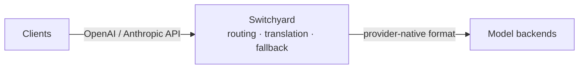

<p align="center">
  
</p>

# Switchyard

Switchyard is a Rust proxy and library for LLM traffic. It routes requests
across providers, translates between OpenAI and Anthropic APIs, records
operational metrics, and provides typed, composable routing algorithms.

**Why Switchyard?** Point a coding agent such as Claude Code or Codex at an
open-source model. Switchyard translates between the OpenAI Chat, Anthropic
Messages, and OpenAI Responses formats, so the agent keeps speaking its native
API while the request is served by vLLM, NVIDIA NIM, Ollama, or any
OpenAI-compatible endpoint. The same proxy can spread traffic across several
models for A/B benchmarking, apply signal-driven stage routing, or run a custom
algorithm you write yourself.

## Features

- **Protocol Translation**: convert between OpenAI Chat, Anthropic Messages, and OpenAI Responses formats
- **Multi-Backend Routing**: random routing, LLM-as-classifier routing, signal-driven stage-router, or custom routers
- **Strong Types**: provider-neutral request, response, and streaming types
- **Explicit Configuration**: TOML defines LLM clients, targets, and algorithm routes
- **Operational Metrics**: Prometheus metrics cover requests, errors, latency, tokens, and routing overhead

## Quick Start

### Install prerequisites

You need Git, a native build toolchain, and Rust with Cargo. On Ubuntu or WSL:

```bash
sudo apt-get update
sudo apt-get install -y build-essential curl git
curl --proto '=https' --tlsv1.2 -sSf https://sh.rustup.rs | sh
source "$HOME/.cargo/env"
```

The Rust installer includes `rustc`, Cargo, and `rustup`. On macOS or native
Windows, follow the [official Rust installation instructions](https://rust-lang.org/tools/install/).

Install `uv` for the repository's Python-based tooling and CI checks. It is not
required to build or run the Rust server:

```bash
curl -LsSf https://astral.sh/uv/install.sh | sh
```

If either installer updates your shell configuration, restart the shell before
continuing. Verify that the tools are available:

```bash
git --version
rustc --version
cargo --version
uv --version
```

### Build the Rust server from source

```bash
git clone https://github.com/NVIDIA-NeMo/Switchyard.git
cd Switchyard
cargo build --locked --release -p switchyard-server
./target/release/switchyard-server --help
```

The repository pins Rust `1.96.1` in `rust-toolchain.toml`; `rustup` selects and
installs it automatically when you run Cargo from the repository. Prebuilt Rust
binaries are not published yet.

### Run the server

The `switchyard-server` binary reads an explicit TOML configuration for LLM
clients, targets, and routes. Create `routes.toml` with an LLM-classifier route:

```toml
schema_version = 1

[llm_clients.openrouter]
format = "openai_chat"
base_url = "https://openrouter.ai/api/v1"
api_key_env = "OPENROUTER_API_KEY"

[targets.weak]
id = "openai/gpt-4o-mini"
llm_client = "openrouter"

[targets.strong]
id = "openai/gpt-4o"
llm_client = "openrouter"

[routes.smart]
id = "switchyard"
type = "llm_classifier"
classifier_target = "weak"
strong_target = "strong"
weak_target = "weak"
base_threshold = 0.5
```

The weak model classifies each request, then serves requests above the threshold
itself and sends the rest to the strong model.

Export the provider credential, validate the configuration without binding a
socket, then start the server:

```bash
export OPENROUTER_API_KEY="your-openrouter-key"  # pragma: allowlist secret
./target/release/switchyard-server --config routes.toml --dry-run
./target/release/switchyard-server --config routes.toml --host 127.0.0.1 --port 4000
```

The route `id` is the model name clients use. In another terminal:

```bash
curl http://localhost:4000/health
curl http://localhost:4000/v1/models
curl http://localhost:4000/v1/chat/completions \
  -H "Content-Type: application/json" \
  -d '{"model":"switchyard","messages":[{"role":"user","content":"hi"}]}'
```

The Rust server also supports random, LLM-classifier, and stage-router routes,
OpenAI Responses and Anthropic Messages endpoints, TLS, and Prometheus metrics.
See the [`switchyard-server` guide](crates/switchyard-server/README.md) for the
complete configuration schema and operational details.

## Architecture

Switchyard sits between your client applications and one or more LLM backends:



Clients keep their native OpenAI or Anthropic API format. Switchyard picks a
configured backend, forwards the request in that backend's own format, and
translates the response back into the shape the client expects.

## Documentation

- **[`switchyard-server`](crates/switchyard-server/README.md)**: server configuration, routing algorithms, and metrics
- **[`switchyard-libsy`](crates/libsy/README.md)**: embed routing algorithms in a Rust application
- **[`switchyard-protocol`](crates/protocol/README.md)**: provider-neutral request, response, and streaming types
- **[`switchyard-translation`](crates/switchyard-translation/README.md)**: request, response, and stream translation

## Supported API Formats

The server exposes:

- OpenAI Chat Completions
- OpenAI Responses
- Anthropic Messages

Configured upstream clients support the same formats. The OpenAI Chat format
also works with compatible servers such as vLLM, NVIDIA NIM, Ollama, and Azure.

## Community

- **Issues**: [GitHub Issues](https://github.com/NVIDIA-NeMo/Switchyard/issues)
- **Code of Conduct**: [Code of Conduct](CODE_OF_CONDUCT.md)

## License

[Apache 2.0 License](LICENSE). Copyright NVIDIA Corporation.
