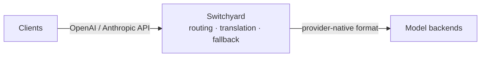

<p align="center">
  
</p>

# Switchyard

Switchyard is a Rust proxy and library for LLM traffic. It routes requests
across providers, translates between OpenAI and Anthropic APIs, records
operational metrics, and provides typed, composable routing algorithms.

**Why Switchyard?** Point a coding agent such as Claude Code or Codex at an
open-source model. Switchyard translates between the OpenAI Chat, Anthropic
Messages, and OpenAI Responses formats, so the agent keeps speaking its native
API while the request is served by vLLM, NVIDIA NIM, Ollama, or any
OpenAI-compatible endpoint. The same proxy can spread traffic across several
models for A/B benchmarking, apply signal-driven stage routing, or run a custom
algorithm you write yourself.

## Features

- **Protocol Translation**: convert between OpenAI Chat, Anthropic Messages, and OpenAI Responses formats
- **Multi-Backend Routing**: random routing, LLM-as-classifier routing, signal-driven stage-router, or custom routers
- **Strong Types**: provider-neutral request, response, and streaming types
- **Explicit Configuration**: TOML defines LLM clients, targets, and algorithm routes
- **Operational Metrics**: Prometheus metrics cover requests, errors, latency, tokens, and routing overhead

## Quick Start

Install the CLI and server dependencies:

```bash
uv tool install "nemo-switchyard[cli,server]"
export OPENROUTER_API_KEY="sk-or-..."
```

Launch a coding agent through the packaged OpenRouter deployment:

```bash
switchyard launch claude --model switchyard
switchyard launch codex --model switchyard
```

Pass a custom native deployment when needed:

```bash
switchyard launch claude --model my-route --config routes.toml
```

The deployment schema belongs in the
[`switchyard-server` README](crates/switchyard-server/README.md).

## Architecture

Switchyard sits between your client applications and one or more LLM backends:



Clients keep their native OpenAI or Anthropic API format. Switchyard picks a
configured backend, forwards the request in that backend's own format, and
translates the response back into the shape the client expects.

## Documentation

- **[`switchyard-server`](crates/switchyard-server/README.md)**: server configuration, routing algorithms, and metrics
- **[`switchyard-libsy`](crates/libsy/README.md)**: embed routing algorithms in a Rust application
- **[`switchyard-protocol`](crates/protocol/README.md)**: provider-neutral request, response, and streaming types
- **[`switchyard-translation`](crates/switchyard-translation/README.md)**: request, response, and stream translation

## Supported API Formats

The server exposes:

- OpenAI Chat Completions
- OpenAI Responses
- Anthropic Messages

Configured upstream clients support the same formats. The OpenAI Chat format
also works with compatible servers such as vLLM, NVIDIA NIM, Ollama, and Azure.

## Community

- **Issues**: [GitHub Issues](https://github.com/NVIDIA-NeMo/Switchyard/issues)
- **Code of Conduct**: [Code of Conduct](CODE_OF_CONDUCT.md)

## License

[Apache 2.0 License](LICENSE). Copyright NVIDIA Corporation.
