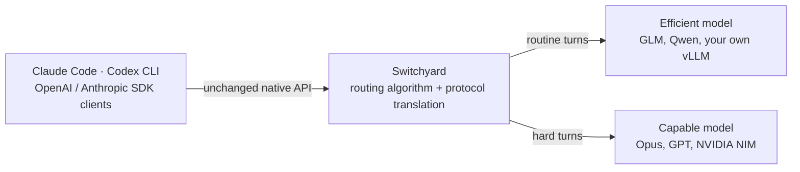

<p align="center">
  
</p>

# Switchyard

**Switchyard routes each LLM call to the cheapest model that can still do the job. Without changing a line of your agent.**

It has three modes:

**1. A Rust proxy** — run it in front of the agent you already use:

```bash
cargo install --locked switchyard-server
switchyard-server --config routes.toml --port 4000
```

**2. An embeddable Rust library** — call the same algorithms from a gateway you already own:

```bash
cargo add --git https://github.com/NVIDIA-NeMo/Switchyard.git --tag v0.2.0 \
  switchyard-libsy switchyard-protocol
```

**3. A NeMo Relay plugin** — load the same `routes.toml` into a NeMo Relay deployment you already run:

```toml
[[plugins.dynamic]]
manifest = "./plugins/switchyard/relay-plugin.toml"

[plugins.dynamic.config]
switchyard_config_path = "/etc/switchyard/routes.toml"
```

Relay runs any routing algorithm `switchyard-runner` supports while Switchyard owns provider HTTP dispatch. See [`switchyard-nemo-relay-plugin`](crates/switchyard-nemo-relay-plugin/README.md).

Point Claude Code, Codex CLI, or any OpenAI/Anthropic SDK client at it. Every request keeps its native API format; Switchyard decides per turn which model serves it.

## Maturity

Switchyard is pre-alpha software that is evolving rapidly. The API and algorithms are expected to change significantly before we reach v1.0.

> [!WARNING]
> Switchyard is a very young project showcasing active research. Component maturity levels:
>
> - libsy: Beta. Ready for trial integration.
> - switchyard-llm-client: Alpha. May change significantly.
> - switchyard-runner: Alpha. Evolving rapidly.
> - switchyard-server: Demo server, not for production use.

## What Is Switchyard

Most routers route on the things around a request: model name, price list,
endpoint health. Switchyard routes on the request itself and on how the agent's
run is going — how hard the task looks, what the last tool calls returned,
and how the model is doing so far.



## Why Switchyard

Every Switchyard route below pairs the same Opus 4.8 capable tier with a cheaper
efficient tier. The baseline is Opus 4.8 serving every turn.


| Configuration | Accuracy | Total cost | vs. Opus 4.8 baseline |
|---|---:|---:|---|
| Opus 4.8 baseline | 76.0% | $98.06 | — |
| **[Escalation](#routing-algorithms)** | 75.7% | $85.00 | 99.6% of accuracy, 13.3% cheaper |
| **[Stage](#routing-algorithms)** | 72.7% | $68.19 | 95.7% of accuracy, 30.5% cheaper |
| **[Capability](#routing-algorithms)** | 71.2% | $79.32 | 93.7% of accuracy, 19.1% cheaper |
| Kimi K2.6 alone | 55.8% | $76.28 | |
| GLM 5.2 alone | 52.4% | $16.47 | |
| DeepSeek V4 Pro alone | 48.7% | $96.92 | |
| Ultra 3 alone | 39.0% | $29.66 | |

## Get Started

Install [Rust with Cargo](https://rust-lang.org/tools/install/), then:

**1. Install the server.**

```bash
cargo install --locked switchyard-server
```

**2. Write `routes.toml`.** A stage router over the same model pair as the
benchmark above: how to reach a provider, which models to use, how to choose
between them. `--config` takes any path; this writes it to the current directory.

```bash
cat > routes.toml <<'TOML'
schema_version = 1

[llm_clients.openrouter]
format = "openai_chat"
base_url = "https://openrouter.ai/api/v1"
api_key_env = "OPENROUTER_API_KEY"

[targets.capable]
id = "anthropic/claude-opus-4.8"
llm_client = "openrouter"

[targets.efficient]
id = "z-ai/glm-5.2"
llm_client = "openrouter"

[routes.switchyard]
id = "switchyard"
type = "stage_router"
capable_target = "capable"
efficient_target = "efficient"
picker = "efficient_first"
confidence_threshold = 0.5
TOML
```

**3. Run it.** `--dry-run` loads the config, prints `server OK:` and the model
IDs it exposes, then exits without starting the server.

```bash
export OPENROUTER_API_KEY="your-openrouter-key"  # pragma: allowlist secret
switchyard-server --config routes.toml --dry-run
switchyard-server --config routes.toml --host 127.0.0.1 --port 4000
```

**4. Send a request.** The route's `id` is the model name clients ask for.

```bash
curl http://localhost:4000/v1/chat/completions \
  -H "Content-Type: application/json" \
  -d '{"model":"switchyard","messages":[{"role":"user","content":"hello"}]}'
```

The same route also answers on `/v1/messages` (Anthropic Messages) and
`/v1/responses` (OpenAI Responses). `/v1/stats` reports which target served
what, and `/metrics` exposes Prometheus counters for requests, errors, latency,
tokens, and routing overhead.

### Point a Coding Agent at It

```bash
export ANTHROPIC_BASE_URL="http://localhost:4000"
export ANTHROPIC_MODEL="switchyard"
claude
```

Codex CLI and other OpenAI clients use the OpenAI variables instead:

```bash
export OPENAI_BASE_URL="http://localhost:4000/v1"
```

### Embed It in Your Own Gateway

`switchyard-libsy` never calls a model: an algorithm returns the target it chose
and hands the call back to you, so it drops into a proxy, gateway, or agent
runtime you already run. Pair it with `switchyard-llm-client` to have the calls
made for you.

```toml
[dependencies]
switchyard-libsy = { git = "https://github.com/NVIDIA-NeMo/Switchyard.git", tag = "v0.2.0" }
switchyard-protocol = { git = "https://github.com/NVIDIA-NeMo/Switchyard.git", tag = "v0.2.0" }
```

See [Getting Started](docs/getting_started.md#library-path) for setup, or the
[`switchyard-libsy`](crates/libsy/README.md) crate docs.

## Routing Algorithms

Most use an LLM as a judge. All of them pick between an **efficient** model and a
**capable** one; what differs is when the decision is made and how.

| Algorithm | How it decides | Route `type` | Benchmark |
|---|---|---|---|
| **[Capability](docs/routing_algorithms/llm_classifier_routing.md)** | The first request is judged by an LLM. | `llm_classifier` | 71.2% at $79.32 |
| **[Stage](docs/routing_algorithms/stage_router_routing.md)** | Tool responses are judged by pattern matching or an LLM. | `stage_router` | 72.7% at $68.19 |
| **[Capability + Stage](docs/routing_algorithms/composite_routing.md)** | Combines the two above. | `composite` | not yet benchmarked |
| **[Escalation](docs/routing_algorithms/escalation_router_routing.md)** | Starts efficient. Responses are judged by an LLM for issues, then escalated. | `llm_classifier` + `mode = "escalation"` | 75.7% at $85.00 |
| **[Advisor Gate](docs/routing_algorithms/advisor_gate_routing.md)** | One model serves every turn; a stronger advisor approves its plans and "done" claims, or sends it back. | `advisor` | lifts a weak executor 43.8% → 54.7% |
| **[Sub-Agent-Aware](docs/routing_algorithms/subagent_routing.md)** | Delegated sub-agent traffic routes separately from the parent agent. | `subagents` on `passthrough` or `stage_router` | not yet benchmarked |
| **[Custom](docs/routing_algorithms/llm_classifier_routing.md#custom-multi-target-routing)** | The first request is judged by an LLM against criteria you define, routing among 2+ of your own models. | `llm_classifier` + `target_selector` policy | not yet benchmarked |
| **[Random](docs/routing_algorithms/random_routing.md)** | Each request is routed at random, uniform or weighted. | `random` | baseline mechanism |

Benchmarks are Terminal-Bench 2.1 against a $98.06 Opus 4.8 baseline at 76.0%.
A `passthrough` route registers one target under one model ID with no routing
decision. See the [Routing Overview](docs/routing_algorithms/overview.md) for
the common route shape and self-hosted targets.

## Documentation

- **[Getting Started](docs/getting_started.md)**: complete standalone server walkthrough
- **[Core Concepts](docs/core_concepts.md)**: LLM clients, targets, routes, model IDs, and routing algorithms
- **[Routing Overview](docs/routing_algorithms/overview.md)**: choose and configure a routing algorithm
- **[TOML Schema](docs/reference/toml_schema.md)**: every configuration key
- **[Architecture](docs/architecture.md)**: how the proxy and library components fit together
- **[`switchyard-server`](crates/switchyard-server/README.md)**: server configuration, routing algorithms, and metrics
- **[`switchyard-libsy`](crates/libsy/README.md)**: embed routing algorithms in a Rust application
- **[`switchyard-protocol`](crates/protocol/README.md)**: provider-neutral request, response, and streaming types
- **[`switchyard-translation`](crates/switchyard-translation/README.md)**: request, response, and stream translation
- **[`switchyard-nemo-relay-plugin`](crates/switchyard-nemo-relay-plugin/README.md)**: install Switchyard as a native NeMo Relay plugin

## Benchmark Provenance

The numbers in [Why Switchyard](#why-switchyard) are the v0.2.0 Terminal-Bench 2.1
results from [Route AI Agent Workloads Across Models with NVIDIA NeMo Switchyard](https://developer.nvidia.com/blog/route-ai-agent-workloads-across-models-with-nvidia-nemo-switchyard/).
Those runs used NVIDIA-internal inference endpoints, so absolute solve rates may
shift on another serving stack; the routing parameters are the ones that ran.

The escalation deployment is checked in at
[`benchmark/routing-profiles/tb21-escalation-opus-glm-deepseek.toml`](benchmark/routing-profiles/tb21-escalation-opus-glm-deepseek.toml),
with OpenRouter targets substituted so it is publicly runnable. To run the
harness, see [`benchmark/README.md`](benchmark/README.md); for latency and
routing overhead rather than task success, see
[Soak Testing](docs/operations/soak_test.md).

## Community

- **Issues**: [GitHub Issues](https://github.com/NVIDIA-NeMo/Switchyard/issues)
- **Code of Conduct**: [Code of Conduct](CODE_OF_CONDUCT.md)

## License

[Apache 2.0 License](LICENSE). Copyright NVIDIA Corporation.
