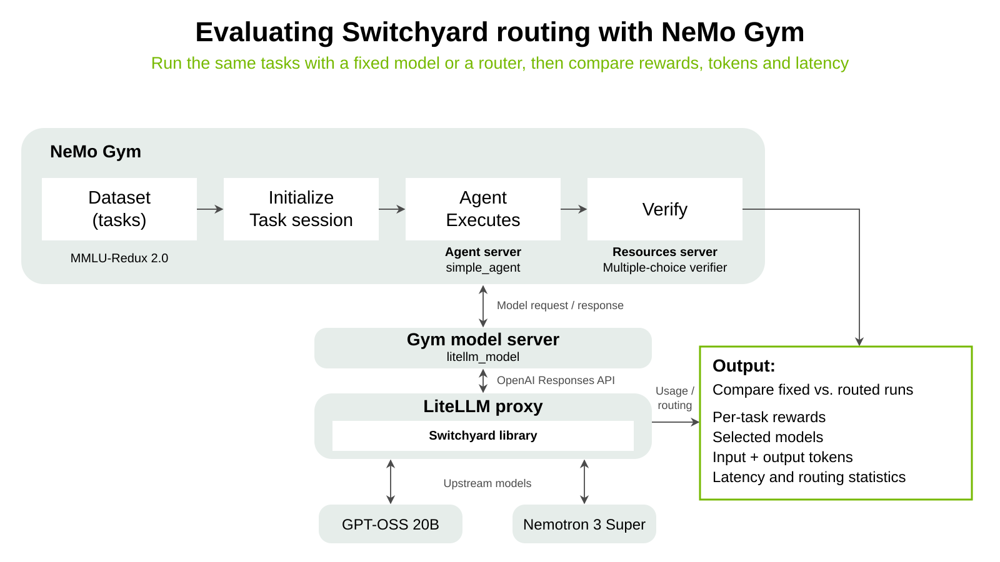

# Evaluate Switchyard routing with NeMo Gym

[NeMo Gym](https://github.com/NVIDIA-NeMo/Gym) is a library for evaluating models and agents using tasks with verifiable outcomes.
This tutorial uses its five included multiple-choice examples to compare a fixed model with Switchyard routing.



## What changes between the runs?

Both routes are defined in [routes.toml](routes.toml):

| Route | Behavior |
|---|---|
| `fixed` | Always use Nemotron 3 Super. |
| `routed` | Ask GPT-OSS 20B to classify the task, then use GPT-OSS 20B or Nemotron 3 Super. |

The dataset, agent, verifier, temperature, and answer-token limit stay the same.
The classifier is an extra model call: its tokens count even when the router selects GPT-OSS 20B.
Super uses `enable_thinking=false`; GPT-OSS 20B uses `reasoning_effort=low`, including for
classification. These per-model settings stay unchanged between conditions. This is not a
benchmark of either model's maximum reasoning capability.

## 1. Install the pinned Gym checkout

You need Git, [uv](https://docs.astral.sh/uv/), two Bash terminals, and an NVIDIA API key for
the public endpoint `https://integrate.api.nvidia.com/v1`. Use these exact model IDs:
`openai/gpt-oss-20b` and `nvidia/nemotron-3-super-120b-a12b`.
Inference may consume credits. The classifier requires strict JSON Schema responses from
its selected model.

**Smoke-tested:** A one-question paired run completed on this endpoint with correct answers
in both conditions, GPT-OSS 20B serving the routed answer, and no reported model or classifier
errors. The full five-question comparison below has not yet been validated for this pair.

Run from the **Switchyard repository root**:

```bash
WORK="$PWD/scratch/nemo-gym-tutorial"
mkdir -p "$WORK" &&
git clone https://github.com/NVIDIA-NeMo/Gym.git "$WORK/Gym" &&
git -C "$WORK/Gym" checkout 3a26c35fa90c243427378569511f7b06f503e0fd &&
uv tool run --from uv==0.11.29 uv venv --python 3.13.14 "$WORK/.venv" &&
uv tool run --from uv==0.11.29 uv pip install \
  --python "$WORK/.venv/bin/python" uv==0.11.29 -e "$WORK/Gym"
```

The pinned uv can download Python 3.13.14 even if your existing uv is older. It is also installed
inside the tutorial environment for Gym's component setup; your global uv is left unchanged.

This keeps the checkout and environment under Switchyard's ignored `scratch/` directory,
without changing another Gym checkout. Use a fresh directory for this one-time setup.
The editable install lets Gym's component environments use the same pinned source.

Gym installs **`nemo-switchyard==0.2.0`** into its model-server environment and hosts the native
proxy in-process. You do **not** need Docker or a separately running `switchyard-server`.
The Switchyard checkout contains this tutorial; its current `main` is **not** the proxy being
executed. Do not copy newer routing options into this version-pinned example.

## 2. Start the fixed condition — Terminal 1

Keep this terminal at the Switchyard repository root. Set your API key in the terminal,
replacing the placeholder with your key:

```bash
export NVIDIA_API_KEY='<your-api-key>'
```

Start Gym's resources, agent, and model servers. Run only one Gym environment at a time.
The first start also installs their dependencies.

```bash
EXAMPLE="$PWD/benchmark/nemo_gym"
WORK="$PWD/scratch/nemo-gym-tutorial"
source "$WORK/.venv/bin/activate"
RUN_DIR="$EXAMPLE/results/first-run"
OUT="$RUN_DIR/fixed"
mkdir -p "$RUN_DIR"

mkdir "$OUT" &&
git -C "$WORK/Gym" rev-parse HEAD > "$OUT/gym-commit.txt" &&
gym env start --resources-server mcqa --model-type switchyard_model --model fixed \
  "++policy_model.responses_api_models.switchyard_model.deployment=$EXAMPLE/routes.toml" \
  ++policy_model.responses_api_models.switchyard_model.switchyard_base_url=null \
  "++policy_model.responses_api_models.switchyard_model.condition_dir=$OUT" \
  ++mcqa_simple_agent.responses_api_agents.simple_agent.max_steps=1 \
  ++observability_enabled=true \
  "++model_call_capture_dir=$OUT/model-calls" \
  "++nemo_gym_log_dir=$OUT/server-logs" \
  "hydra.run.dir=$OUT/hydra-start"
```

Wait for **`All 3 / 3 servers ready!`**. Leave this terminal running.
`mkdir "$OUT"` deliberately refuses to reuse an existing condition directory.
For a new comparison, change `RUN_DIR` to the same fresh path in **both terminals**.

## 3. Run the five questions — Terminal 2

Open another Bash terminal at the **same Switchyard repository root**:

```bash
EXAMPLE="$PWD/benchmark/nemo_gym"
WORK="$PWD/scratch/nemo-gym-tutorial"
source "$WORK/.venv/bin/activate"
RUN_DIR="$EXAMPLE/results/first-run"
OUT="$RUN_DIR/fixed"

gym eval run --no-serve --agent mcqa_simple_agent \
  --input "$WORK/Gym/resources_servers/mcqa/data/example.jsonl" \
  --output "$OUT/rollouts.jsonl" \
  --limit 5 --num-repeats 1 --concurrency 1 \
  --temperature 0 --max-output-tokens 4096 \
  ++route_failures_to_sidecar=true \
  ++observability_enabled=true \
  "++model_call_capture_dir=$OUT/model-calls" \
  "hydra.run.dir=$OUT/hydra-eval"
```

These questions are included with Gym. The MCQA resources server checks the answer letter
against the expected answer; it does not call an LLM judge. A wrong answer earns zero reward.
An infrastructure failure is a different outcome, recorded separately.

The two-terminal flow is intentional: Gym's one-command evaluation mode does not accept
`--split example`. `--no-serve` collects against the servers you already started.

**After collection finishes, press Ctrl-C in Terminal 1 and wait for shutdown to finish.**
Gym writes `switchyard-stats.json` during shutdown, before stopping its hosted proxy.
Do not compare the runs before that file has been written. If Gym reports that a worker
exceeded its shutdown timeout, still wait for shutdown and check the statistics file.
Missing statistics are a failed run, not zero usage.

## 4. Repeat with routing

Use the same two terminals, environment, API key, and `RUN_DIR` as the fixed run.
Do not change the TOML or generation settings. Run each **complete block** below: both
terminals must use the `routed` directory, not the earlier `fixed` directory.

**Terminal 1 — start the routed servers, after stopping the fixed servers:**

```bash
OUT="$RUN_DIR/routed"
mkdir "$OUT" &&
git -C "$WORK/Gym" rev-parse HEAD > "$OUT/gym-commit.txt" &&
gym env start --resources-server mcqa --model-type switchyard_model --model routed \
  "++policy_model.responses_api_models.switchyard_model.deployment=$EXAMPLE/routes.toml" \
  ++policy_model.responses_api_models.switchyard_model.switchyard_base_url=null \
  "++policy_model.responses_api_models.switchyard_model.condition_dir=$OUT" \
  ++mcqa_simple_agent.responses_api_agents.simple_agent.max_steps=1 \
  ++observability_enabled=true \
  "++model_call_capture_dir=$OUT/model-calls" \
  "++nemo_gym_log_dir=$OUT/server-logs" \
  "hydra.run.dir=$OUT/hydra-start"
```

Wait for **`All 3 / 3 servers ready!`**.

**Terminal 2 — collect the routed results:**

```bash
OUT="$RUN_DIR/routed"
gym eval run --no-serve --agent mcqa_simple_agent \
  --input "$WORK/Gym/resources_servers/mcqa/data/example.jsonl" \
  --output "$OUT/rollouts.jsonl" \
  --limit 5 --num-repeats 1 --concurrency 1 \
  --temperature 0 --max-output-tokens 4096 \
  ++route_failures_to_sidecar=true \
  ++observability_enabled=true \
  "++model_call_capture_dir=$OUT/model-calls" \
  "hydra.run.dir=$OUT/hydra-eval"
```

**After collection finishes, press Ctrl-C in Terminal 1 and wait for shutdown.**
The comparison needs `routed/switchyard-stats.json`, which does not exist while those
servers are still running. Only then continue to Step 5.

The route is selected when **starting the servers**. Changing a model flag only on
`gym eval run --no-serve` does not change a running server's route.

On the clean path, these five tasks use 15 upstream calls in total: five fixed answers,
five classifier calls, and five routed answers. `routes.toml` disables Switchyard HTTP
retries, but this is not a hard spending cap: Gym retries and routing fallbacks can add calls.
The answer limit is 4,096 tokens; the separate classifier limit is 512 tokens. These are limits,
not fixed usage. Keep the same answer limit and per-model reasoning settings in both conditions.

## 5. Compare the runs

After **both server runs have shut down**, run this in Terminal 2 with the same variables
and environment. This prints the comparison table; routed collection alone does not.
The command only reads saved files and makes no inference calls.

```bash
python "$EXAMPLE/compare.py" "$RUN_DIR/fixed" "$RUN_DIR/routed"
```

The script first reports expected, completed, missing, unmatched, and failed rollouts. It
requires identical materialized tasks and generation settings, matching deployment hashes,
the pinned versions, one successful captured model call per task, and usable final answers.
It refuses partial comparisons: classifier statistics cover the whole run and cannot be
fairly combined with only a successful subset of tasks.

Then it prints paired mean reward, selected-model tokens, classifier tokens, their combined
reported total, mean rollout latency, routing overhead, request/error counts, and selected
models. Model names come from `ng_model_call_capture.calls[].model`, not the agent's top-level
`response.model`, which may contain only the route name. Capture token totals must agree with
proxy totals. The capture summaries retain model/status/usage fields; the script does not
expect raw response payloads inside them.

- **Rollout latency** includes the agent, model request, and verification.
- **Routing overhead** is Switchyard's reported routing time, including classifier work.
  It is already part of end-to-end latency; do not add it again.
- **Tokens are not dollars.** Model prices differ, and provider-reported usage may be incomplete.
- **Zero errors does not prove every classifier decision was valid.** Switchyard 0.2.0 can
  fall back to the strong model after an unusable verdict without incrementing classifier
  errors. Inspect `server-logs/policy_model.log`; the report labels this limitation.

### Interpreting your result

The report describes your own runs: there are no fixed expected scores or routing proportions.
Fewer answer-model tokens do not necessarily mean fewer combined tokens once classifier
usage is included. Routing decisions and service latency can vary. Five questions demonstrate
the workflow, not a statistically meaningful routing advantage.

## What was saved?

Each condition has its own directory under `RUN_DIR`:

| Artifact | What it tells you |
|---|---|
| `gym-commit.txt` | Exact Gym source revision. |
| `switchyard-condition.json` | Route, hosted Switchyard version, deployment hash, and redacted configuration. |
| `switchyard-stats.json` | Shutdown snapshot: selected-model and classifier usage, latency, errors, and routing statistics. |
| `rollouts_materialized_inputs.jsonl` | The exact tasks and generation settings, with task/repeat indexes for pairing. |
| `rollouts.jsonl` / `rollouts_failures.jsonl` | Completed results and separately recorded infrastructure failures. |
| `rollouts_aggregate_metrics.json` | Gym's aggregate evaluation metrics. |
| `model-calls/` | Raw per-rollout requests and responses. Normalized summaries appear in the rollout's `ng_model_call_capture`. |
| `server-logs/` | Gym component logs, including Switchyard routing decisions and classifier warnings. |
| `hydra-start/` / `hydra-eval/` | Resolved configuration snapshots from the two commands, kept out of the repository root. |

Keep keys in environment variables, not in TOML or committed files. Captures contain task
prompts and model responses; review them before sharing.

## Next experiment

To change models or providers, edit `llm_clients` and `targets` in `routes.toml` **before**
running both conditions into a fresh result directory. The classifier provider must support
the pinned version's strict JSON Schema output. To make the smoke test smaller, use
`--limit 1` in both collections; the clean path then has three upstream calls.

For other benchmarks, agent harnesses, and externally managed proxies, see the
[Gym Switchyard integration reference](https://docs.nvidia.com/nemo/gym/main/model-server/switchyard/).
This small comparison script deliberately supports only the hosted, single-turn setup above.
