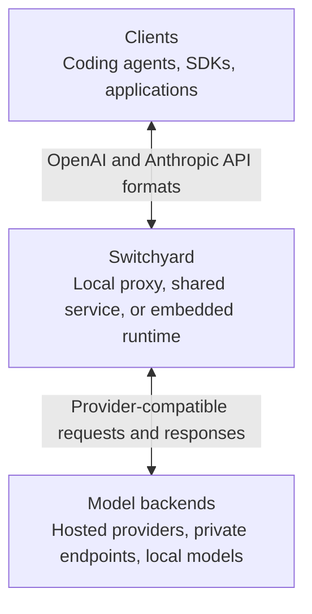
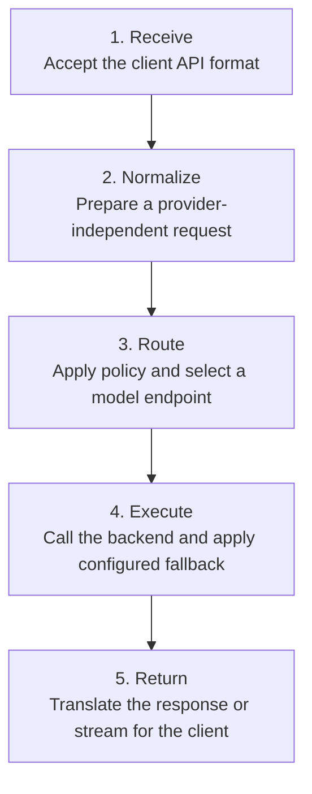
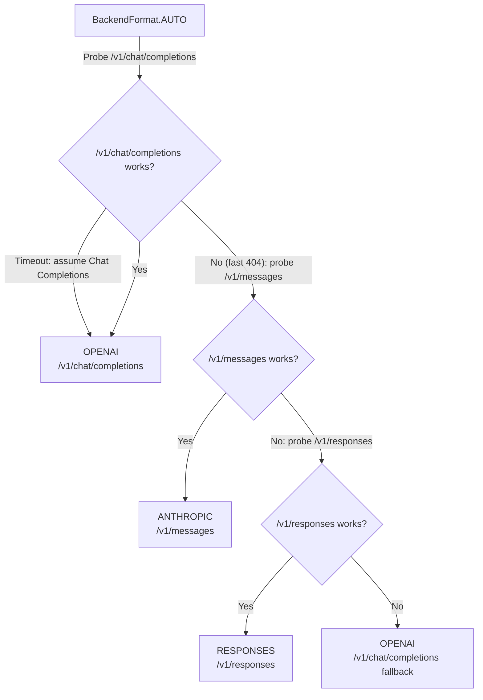

# Switchyard Architecture

Switchyard is an LLM traffic proxy that sits between clients and model
backends. It keeps the client-facing API stable while applying routing policy,
translating provider formats, and handling configured fallbacks.

## System Context

Clients connect using supported OpenAI or Anthropic API formats. Switchyard can
route a request to a backend with a different native format and still return the
response shape expected by the client.

## Request Lifecycle

Routing policy determines which model or endpoint receives a request. Depending
on the selected strategy, that decision can use fixed weights, a classifier,
request signals, or conversation affinity. See the
[Routing Overview](routing_algorithms/overview.md) for the available strategies.

## Backend Wire Format

`BackendFormat` controls the upstream endpoint Switchyard calls. Explicit
formats select an endpoint directly and do not run capability probes.

| Format | Upstream behavior | Use when |
|---|---|---|
| `ANTHROPIC` | Always sends to `/v1/messages`. No probe. | You know the upstream is Anthropic-native (Anthropic API, NIM Claude routes). |
| `RESPONSES` | Always sends to `/v1/responses`. No probe. | You know the upstream supports the OpenAI Responses API. Fails on NIM / non-OpenAI upstreams. |
| `OPENAI` | Always sends to `/v1/chat/completions`. No probe. | You know the upstream is OpenAI-compatible (NIM, OpenRouter, etc). Safe universal choice. |
| `AUTO` | Probes at startup and picks the best format. | The upstream is unknown or varies across deployments. |
| *(omitted)* | Defaults to `OPENAI` with no probe. | Always set `format:` explicitly when the upstream is not OpenAI-compatible. |

### AUTO Decision Tree

Supported inbound and response formats are handled automatically.
`TranslationEngine` converts the client's request to the resolved backend
format and translates the backend response back to the client's expected
format. When a cross-format conversion is required, both directions decode to
and re-encode from the neutral conversation IR. This lets Claude Code, Codex,
OpenClaw, and SDK clients use their native wire format with any supported
upstream format.

> Prefer an explicit format for controlled deployments. It skips capability
> probes and makes the upstream contract clear. Use `AUTO` when provider
> capabilities are unknown or vary across deployments.
>
> **`AUTO` costs startup latency.** Each probe is a live request to the upstream,
> so a slow endpoint adds a round-trip per probe, with up to three tried in
> order. Set `format:` explicitly to remove probing.

## Related Documentation

- [Getting Started](getting_started.md): install Switchyard and run a first request
- [Routing Overview](routing_algorithms/overview.md): choose and configure a routing strategy
- [CLI Reference](cli_reference.md): configure and operate Switchyard from the command line
