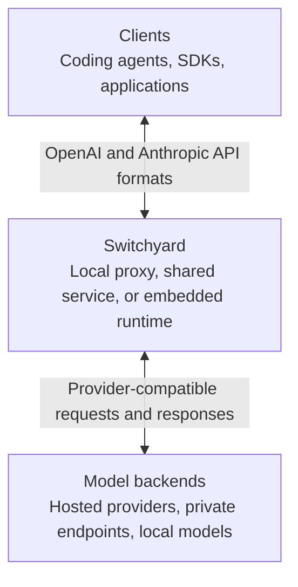
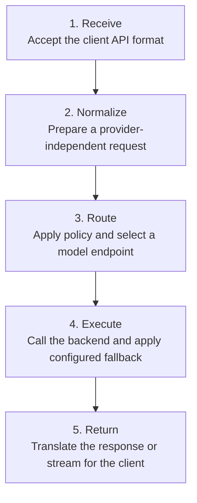
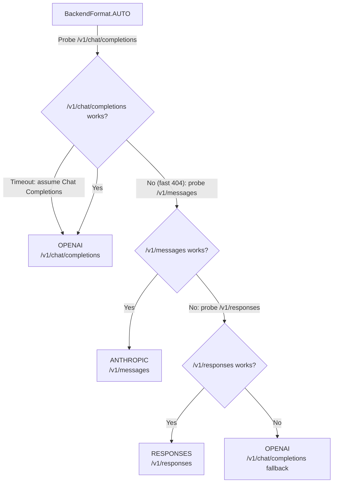

Switchyard is an LLM traffic proxy that sits between clients and model
backends. It keeps the client-facing API stable while applying routing policy,
translating provider formats, and handling configured fallbacks.

## System Context

Clients connect using supported OpenAI or Anthropic API formats. Switchyard can
route a request to a backend with a different native format and still return the
response shape expected by the client.

## Request Lifecycle

Routing policy determines which model or endpoint receives a request. Depending
on the selected strategy, that decision can use fixed weights, a classifier,
request signals, or conversation affinity. See the
[Routing Overview](/routing/overview) for the available strategies.

## Backend Wire Format

`BackendFormat` controls the upstream endpoint Switchyard calls. Explicit
formats select an endpoint directly and do not run capability probes.

| Format | Upstream behavior | Use when |
|---|---|---|
| `ANTHROPIC` | Always sends to `/v1/messages`. No probe. | You know the upstream is Anthropic-native (Anthropic API, NIM Claude routes). |
| `RESPONSES` | Always sends to `/v1/responses`. No probe. | You know the upstream supports the OpenAI Responses API. Fails on NIM / non-OpenAI upstreams. |
| `OPENAI` | Always sends to `/v1/chat/completions`. No probe. | You know the upstream is OpenAI-compatible (NIM, OpenRouter, etc). Safe universal choice. |
| `AUTO` | Probes at startup, picks best format (see below). | Upstream is unknown or varies across deployments. Used by Claude Code and Codex launchers. OpenClaw is intentionally pinned to `OPENAI`. |
| *(omitted)* | Defaults to `OPENAI` — no probe, no fast-path. Silently uses Chat Completions, which is wrong for Anthropic/Bedrock models. Always set `format:` explicitly. |  |
Claude Code and Codex launchers use `AUTO` for their single-model targets.
OpenClaw is intentionally pinned to `OPENAI` for its equivalent target.

### AUTO Decision Tree

Supported inbound and response formats are handled automatically.
`TranslationEngine` converts the client's request to the resolved backend
format and translates the backend response back to the client's expected
format. When a cross-format conversion is required, both directions decode to
and re-encode from the neutral conversation IR. This lets Claude Code, Codex,
OpenClaw, and SDK clients use their native wire format with any supported
upstream format.

> Prefer an explicit format for controlled deployments. It skips capability
> probes and makes the upstream contract clear. Use `AUTO` when provider
> capabilities are unknown or vary across deployments.
>
> **`AUTO` costs startup latency.** Each probe is a live request to the upstream
> made before the agent starts, so a slow endpoint adds a round-trip per probe
> (up to three, tried in order). This is the main reason a launch that uses
> `AUTO` (Claude Code, Codex) starts slower than one pinned to an explicit
> format. Set `format:` explicitly to remove the probing entirely. To see the
> per-probe cost of a launch, run it with `--startup-timing` (or
> `SWITCHYARD_STARTUP_TIMING=1`), which prints each probe on its own line.
## Related Documentation

- [Getting Started with Switchyard](/get-started/getting-started): install Switchyard and run a first request
- [Agent Launchers](/guides/agent-launchers): run coding agents through a local proxy
- [Routing Overview](/routing/overview): choose and configure a routing strategy
- [CLI Reference](/reference/cli-reference): configure and operate Switchyard from the command line
