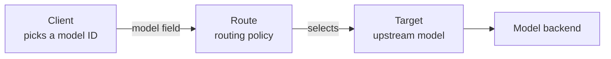

# Core Concepts

This page explains the vocabulary used throughout the documentation. For setup,
see [Getting Started](getting_started.md). For the request lifecycle, see
[Architecture](architecture.md).

## How it fits together

Switchyard is a proxy. Clients such as coding agents and SDKs talk to it on one
side, while hosted providers, private endpoints, and local model servers sit on
the other. A client sends a model ID, and the route registered under that ID
decides what runs.

## Routes and targets

The Python CLI loads a YAML bundle with a `routes:` section. Each route has a
client-facing name and a `type` that chooses its behavior. Depending on that
type, the route owns one target, two routing tiers, or a larger endpoint list.

Shared `defaults:` can provide a base URL, API key, and backend format without
repeating them in every target. The [Routing Overview](routing_algorithms/overview.md)
has a complete runnable bundle.

## Model IDs

Every route name is registered as a model ID and listed on `GET /v1/models`.
Clients select a route by putting that name in the request's `model` field.
Some route types also discover or register direct upstream model IDs.

## Tiers and routing strategies

Most routing strategies divide traffic between two tiers: a strong target that
is more capable and more expensive, and a weak target that is cheaper and
faster. A tier is a role assigned inside a route, not a fixed property of a
model.

A route's `type` sets the strategy. `model` and `passthrough` call one target.
`random_routing` splits traffic on a fixed probability. `deterministic` asks a
classifier model to pick a tier. `stage_router` uses agent-progress signals,
with an optional classifier fallback. The
[Routing Overview](routing_algorithms/overview.md) explains when to use each.

Session affinity pins a conversation to one tier so later turns reuse it
instead of being classified again. It belongs to deterministic classifier
routing and is not a strategy of its own. Random and stage-router routing make
a decision for every request. [Sticky Routing](routing_algorithms/sticky_routing.md)
covers affinity in full.

## Formats and translation

Clients reach Switchyard through OpenAI Chat Completions, Anthropic Messages,
or OpenAI Responses. Each target has a backend format: `openai`, `anthropic`,
`responses`, or `auto`. When the inbound and backend formats differ,
Switchyard translates the request on the way out and the response on the way
back.

That translation lets Claude Code, which speaks Anthropic Messages, run against
an OpenAI-compatible model. The [Architecture](architecture.md) page documents
the supported formats and request lifecycle.

## Programmatic Python profiles

Embedded Python callers can construct typed profile configs and runtimes
directly instead of loading a route bundle. `ProfileInput` carries the request
and request metadata, while the profile protocols define `run`, `process`, and
`rprocess`. This programmatic API is separate from CLI configuration.

## Rust server configuration

The `switchyard-server` binary is built directly on libsy. Its TOML file
explicitly defines LLM clients, targets, and algorithm routes; it does not load
Python route bundles. See the
[Rust server README](../crates/switchyard-server/README.md) for details.

## Where to go next

- [Getting Started](getting_started.md) to install and send a first request.
- [Routing Overview](routing_algorithms/overview.md) to choose and tune a strategy.
- [Agent Launchers](guides/agent_launchers.md) to run Claude Code, Codex, or OpenClaw.
- [Architecture](architecture.md) to see a request travel end to end.
- [CLI Reference](cli_reference.md) for flags and environment variables.
