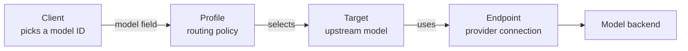

This page explains the vocabulary the rest of the documentation takes for
granted. Read it once and the configuration examples elsewhere will make sense.
It is not a setup guide: to install and run Switchyard, see
[Getting Started with Switchyard](/get-started/getting-started), and to follow a request through the
system, see [Switchyard Architecture](/concepts/architecture).

## How it fits together

Switchyard is a proxy. Clients (coding agents, SDKs, your own services) talk to
it on one side, and model backends (hosted providers, private endpoints, local
models) sit on the other. A client never asks for a backend by name. It sends a
model ID, and the configuration behind that ID decides what actually runs.

## Endpoints, targets, and profiles

A standalone deployment is described by a profile config: one file with three
sections that keep provider connectivity, upstream models, and client-facing
policy apart. Three terms carry most of the weight.

| Term | What it is | YAML section |
|---|---|---|
| Endpoint | A provider connection: a `base_url` and its credentials. Many targets can share one. | `endpoints:` |
| Target | A single upstream model you can call. It names an endpoint, a `model`, and a wire `format`. | `targets:` |
| Profile | A client-facing routing policy over one or more targets. Its `type` is the routing strategy. | `profiles:` |

The three nest. An endpoint is reused by targets, and targets are referenced by
profiles. You set credentials in one place, add a model once, and build as many
policies on top as you need. The [Routing Overview](/routing/overview)
has a complete, runnable config and the full schema.

## Model IDs

Clients choose what happens through the `model` field on a request. Switchyard
registers three kinds of model IDs and lists them all on `GET /v1/models`:
profile IDs, which apply a routing policy; target IDs, which skip routing and
call that one model; and the upstream model name itself, registered as an alias
whenever it differs from its target ID. Send a profile ID when you want routing,
or a target or upstream name when you want to pin a single model.

## Tiers and routing strategies

Most routing strategies divide traffic between two tiers: a strong target that
is more capable and more expensive, and a weak target that is cheaper and
faster. A tier is a role you hand to a target rather than a fixed property of it,
so the same target can be the strong tier in one profile and the weak tier in
another.

A profile's `type` sets the strategy. `passthrough` sends everything to one
target with no routing. `random-routing` splits traffic on a fixed probability.
`llm-routing` asks a classifier model to pick a tier for each turn. `stage_router`
escalates from weak to strong when request signals call for it. The
[Routing Overview](/routing/overview) covers when to use each and
how to tune it.

<Warning title="There is no type: model">
The current profile config does not have a `type: model`. To expose a single
model, point clients at a target ID directly, or add a `passthrough` profile
when you want a second name for it. `type: model` survives only in the
deprecated `--routing-profiles` bundles used by the launcher compatibility
path.
</Warning>

Session affinity, or sticky routing, pins a conversation to one tier so later
turns reuse it instead of being classified again. It belongs to `llm-routing`
and is not a strategy of its own; random and stage-router routing decide every
request on its own merits. [Sticky Routing](/routing/sticky-routing)
covers it in full.

## Formats and translation

Clients reach Switchyard in one of three inbound formats: OpenAI Chat
Completions, Anthropic Messages, or OpenAI Responses. Each target has its own
backend format, set by its `format:` field, which is one of `openai`,
`anthropic`, `responses`, or `auto`. When the two differ, Switchyard translates
the request on the way out and the response on the way back.

That translation is what lets Claude Code, which speaks Anthropic Messages, run
against an OpenAI-compatible model, and the reverse. The
[Switchyard Architecture](/concepts/architecture) page documents every backend format, the `auto`
probe, and the neutral representation used to convert between them.

## Where to go next

- [Getting Started with Switchyard](/get-started/getting-started) to install and send a first request.
- [Routing Overview](/routing/overview) to choose and tune a strategy.
- [Agent Launchers](/guides/agent-launchers) to run Claude Code, Codex, or OpenClaw.
- [Switchyard Architecture](/concepts/architecture) to see a request travel end to end.
- [CLI Reference](/reference/cli-reference) for flags and environment variables.
