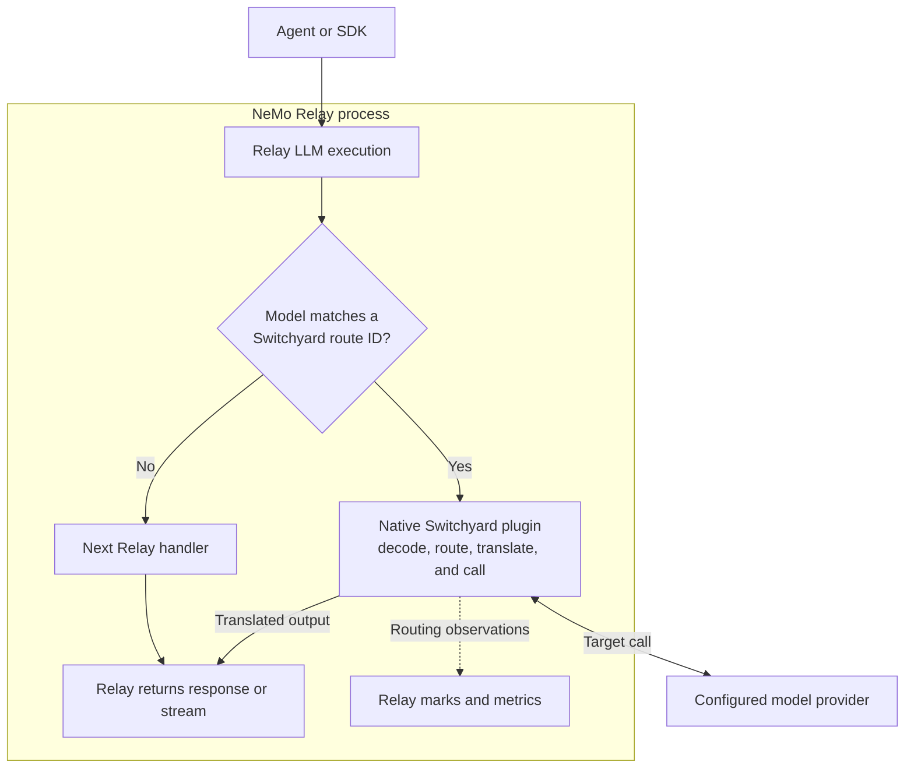
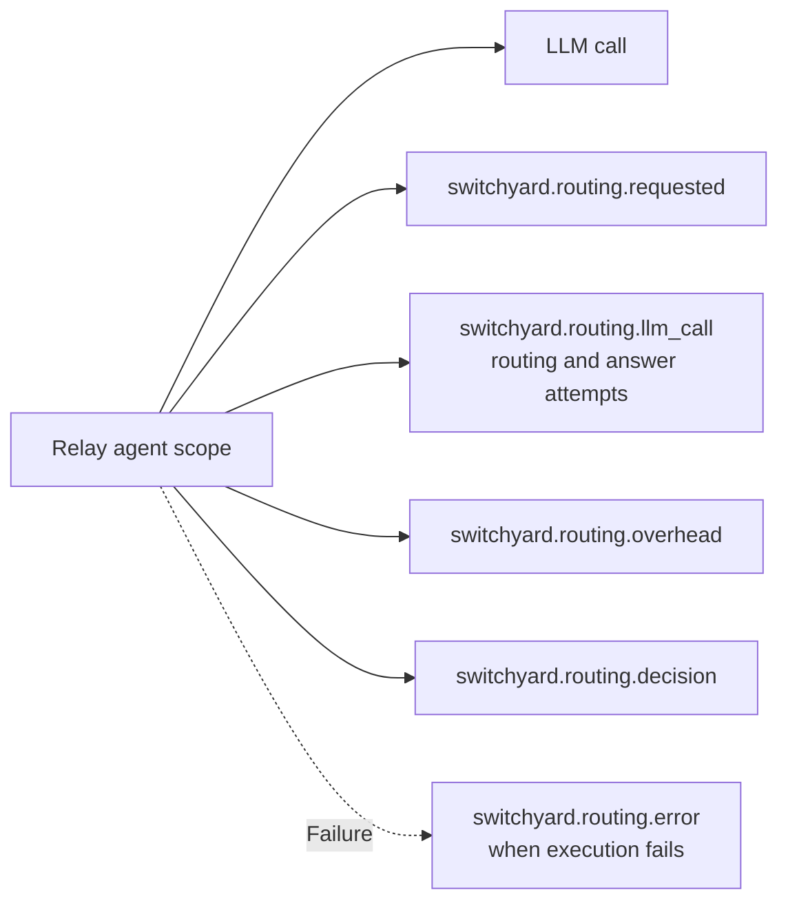

# Use Switchyard with NeMo Relay

Use the
[Switchyard native plugin](../../crates/switchyard-nemo-relay-plugin/README.md)
to add model routing to an existing
[NeMo Relay](https://docs.nvidia.com/nemo/relay/v0.8.3/about-nemo-relay/overview#integrating-with-relay)
deployment without running a second service. It runs through Relay's
[native plugin system](https://docs.nvidia.com/nemo/relay/v0.8.3/build-plugins/native/about).
Relay receives the application's model request and keeps its normal
[middleware](https://docs.nvidia.com/nemo/relay/v0.8.3/about-nemo-relay/concepts/middleware#what-middleware-is)
and
[observability](https://docs.nvidia.com/nemo/relay/v0.8.3/configure-plugins/observability/about#shortest-path).
Switchyard chooses and calls the configured model target.

Use this integration when Relay already handles your agent's model calls and
you want to:

- present one route name while Switchyard chooses the model;
- reuse the same Switchyard TOML deployment as `switchyard-server`;
- inspect routing decisions and model attempts through Relay's existing
  telemetry; and
- keep Relay's existing handling for models that Switchyard does not manage.

If Relay is not part of the application, run the [standalone server](../getting_started.md#server-path)
or embed [`switchyard-libsy`](../../crates/libsy/README.md) directly.

## How Requests Flow

Relay loads the plugin into its own process. For each supported model request,
the plugin checks whether the requested model matches a configured Switchyard
route. Matching requests go through Switchyard. Other requests are left
unchanged by Switchyard and passed to the next Relay handler. The plugin uses
Relay's
[execution intercepts](https://docs.nvidia.com/nemo/relay/v0.8.3/about-nemo-relay/concepts/middleware#execution-intercepts)
for non-streaming requests and
[stream execution intercepts](https://docs.nvidia.com/nemo/relay/v0.8.3/about-nemo-relay/concepts/middleware#stream-execution-intercepts)
for streaming requests.

For a matching request, Switchyard performs model selection, provider calls,
retries, and fallback itself. Model calls used to make a routing decision, as
well as calls to the selected or fallback answer model, do not run through
Relay's LLM middleware again. This avoids treating a router's judge call or
fallback attempt as another application request.

Relay still records the caller-facing
[LLM call](https://docs.nvidia.com/nemo/relay/v0.8.3/instrument-applications/instrument-llm-call#integration-pattern),
while Switchyard adds
[marks](https://docs.nvidia.com/nemo/relay/v0.8.3/about-nemo-relay/concepts/events#mark)
and metrics for the routing work inside it.

| Owner | Responsibilities |
| --- | --- |
| Relay | Receives the caller's request, runs Relay middleware, returns the response or stream, and exports telemetry. |
| Switchyard | Chooses a target, translates formats, calls the provider, and handles configured retries and fallback. |
| Model provider | Runs the model and returns its response, stream, and available usage. |

For more detail, see Relay's
[managed execution pipeline](https://docs.nvidia.com/nemo/relay/v0.8.3/about-nemo-relay/architecture#managed-execution-pipeline)
and
[plugin delivery models](https://docs.nvidia.com/nemo/relay/v0.8.3/about-nemo-relay/concepts/plugins#plugin-delivery-models).

## Set Up the Plugin

Follow the [plugin README](../../crates/switchyard-nemo-relay-plugin/README.md)
to build and package the native library, register and enable it in Relay, and
configure its deployment. Relay documents how to
[add and enable a discoverable plugin](https://docs.nvidia.com/nemo/relay/v0.8.3/configure-plugins/discoverable-plugins#add-and-enable-a-plugin)
and how it
[validates the package before loading code](https://docs.nvidia.com/nemo/relay/v0.8.3/configure-plugins/discoverable-plugins#validate-before-loading-code).

!!! note "Relay compatibility"

    You do not need Relay 0.8.3 specifically. The packaged
    [`relay-plugin.toml`](../../crates/switchyard-nemo-relay-plugin/relay-plugin.toml)
    is the source of truth: it currently accepts Relay `>=0.8.1,<0.9.0` and
    native plugin API `1`. Relay checks both before loading the library. Links
    on this page point to version 0.8.3 so the documentation does not drift to
    an unsupported Relay release.

The plugin accepts exactly one Switchyard deployment source: a
`switchyard_config_path` shared with `switchyard-server`, or the same version-1
deployment nested under `switchyard_config`. Both use the
[Switchyard TOML schema](../reference/toml_schema.md).

The plugin reuses the deployment's routes, targets, and LLM clients. It does not
use Switchyard's `fallback_client` for an unmatched model. Relay's next handler
decides what happens to that request.

The `id` of each configured Switchyard route becomes a model name that callers
can send through Relay. No additional Relay route table is required for those
model names.

## Request Handling

The plugin handles these Relay LLM calls:

- OpenAI Chat Completions (`openai.chat_completions`)
- OpenAI Responses (`openai.responses`)
- Anthropic Messages (`anthropic.messages`)

Only requests whose `model` is a string matching a Switchyard route ID are
routed. Other call types, missing or non-string model values, and unconfigured
model names are left unchanged by Switchyard and passed to Relay's next handler.

The caller and selected target may use different supported API formats.
Switchyard normalizes the request, routes it, and returns the response in the
caller's original format. If Switchyard forwards the caller's credential, both
formats must use the same credential family: OpenAI-compatible or Anthropic.

Not every provider-specific field has a lossless equivalent. Switchyard rejects
a conversion it cannot perform safely instead of silently dropping data.

### Streaming

For streaming requests, Switchyard hands Relay a lazy translated stream. Relay
drives delivery and cancellation and records when the caller-facing stream
starts and ends. As Relay consumes the stream, Switchyard continues to translate
chunks and record late usage or errors.

- Initial routing marks are available when the stream opens.
- An answer-call result of `ok` means the provider opened the stream. It does
  not guarantee that the full stream completed.
- For an upstream response that remains streamed, answer token metrics appear
  only if the provider reports usage and the stream reaches its final event. A
  canceled or dropped stream may have no answer-token metrics.
- Later provider failures can emit `switchyard.routing.error`. Some failures
  before routing or while encoding Relay output have no Switchyard mark, so the
  marks are not a complete request-failure log.
- If Relay rejects a telemetry event, the plugin writes the error to standard
  error and still returns the model response.

## State and Identity

The plugin keeps request and response data in memory only while handling the
call. For a stream, that data remains until the stream finishes or the caller
drops it. The plugin does not store these payloads on disk.

The plugin creates one Switchyard runner when Relay activates it and shares the
runner across requests until the plugin is deactivated. Some routing algorithms
keep in-memory state there, such as session affinity or an escalation decision.
Each algorithm controls when that state expires. The state is not shared between
Relay processes and is lost when a process restarts. See Relay's documentation
on
[plugin ownership](https://docs.nvidia.com/nemo/relay/v0.8.3/about-nemo-relay/concepts/plugins#ownership-and-scope)
and
[runtime state](https://docs.nvidia.com/nemo/relay/v0.8.3/about-nemo-relay/architecture#where-runtime-state-lives).

To associate routing telemetry with the rest of an agent run, the plugin adds
these fields to every routing mark, including marks that carry metric
measurements. Missing values are `null`:

- `session_id`
- `agent_id`
- `parent_agent_id`
- `task_id`
- `turn_id`
- `correlation_id`

These fields are event metadata used to correlate routing records with a run.
Subscribers and log or trace exporters can read them, but Relay does not copy
them into exported metric attributes.

These values come from request headers rather than Relay's active scope. Relay's
[session and subagent headers](https://docs.nvidia.com/nemo/relay/v0.8.3/nemo-relay-cli/basic-usage#runtime-mapping)
can populate them for correlation. They do not by themselves mark a request as
delegated work for Switchyard's
[`subagents` router](../routing_algorithms/subagent_routing.md). For algorithms
that keep per-session state, reuse a stable session ID across turns. Relay's
`x-nemo-relay-session-id` header is accepted; `x-switchyard-session-id`
provides an explicit override. If Relay's gateway has no stable session ID, the
plugin leaves the Switchyard session ID unset. Send `x-switchyard-session-id`
when an algorithm must keep the same per-session state across turns.

## Routing Telemetry

Switchyard sends its routing records into the same Relay telemetry stream as
the caller-facing LLM call. Existing Relay
[subscribers](https://docs.nvidia.com/nemo/relay/v0.8.3/about-nemo-relay/concepts/subscribers#how-subscribers-relate-to-events)
can export both, so a separate Switchyard telemetry pipeline is not required.
How those records appear in a backend depends on Relay's
[OpenTelemetry trace projection](https://docs.nvidia.com/nemo/relay/v0.8.3/configure-plugins/observability/opentelemetry#trace-projections)
and
[OpenInference projection](https://docs.nvidia.com/nemo/relay/v0.8.3/configure-plugins/observability/openinference#plugin-configuration).

### How Routing Appears in Traces

When the caller-facing LLM call uses Relay's active agent scope as its parent,
the Switchyard marks use that same scope and appear alongside the call.
Switchyard does not create another nested scope. For Relay's
[full and OpenInference trace projections](https://docs.nvidia.com/nemo/relay/v0.8.3/configure-plugins/observability/opentelemetry#trace-projections),
[`mark_projection`](https://docs.nvidia.com/nemo/relay/v0.8.3/configure-plugins/observability/opentelemetry#trace-endpoint-fields)
controls whether a backend displays each eligible mark as an event on the
parent or as a visible zero-duration child span. The
[`gen_ai` projection](https://docs.nvidia.com/nemo/relay/v0.8.3/configure-plugins/observability/opentelemetry#genai-projection)
omits marks. With `mark_projection = "tool"`, the trace has this shape:

If the application did not create an agent scope, an observability backend can
display the LLM span and marks as separate roots. The metadata field
`parent_agent_id` is a correlation value; it does not set Relay trace
parentage. See Relay's
[scope hierarchy](https://docs.nvidia.com/nemo/relay/v0.8.3/about-nemo-relay/concepts/scopes#scope-hierarchy-and-ownership)
for the parentage rules.

### Mark Contract

Dashboards and subscribers can use `data_schema` to identify the payload
contract. Each non-metric mark uses the mark name as its schema name and version
`1`. Consumers should accept additional fields and values within a version.
Removing or renaming a field, changing its type, or changing its meaning
requires a new version. Relay's
[event envelope](https://docs.nvidia.com/nemo/relay/v0.8.3/about-nemo-relay/concepts/events#fields-common-to-every-event)
describes the surrounding event envelope.

| Mark | Severity | Data |
| --- | --- | --- |
| `switchyard.routing.requested` | Info | Routing `algorithm` for a managed request. |
| `switchyard.routing.llm_call` | Debug | `call_index`, model in `selected_model`, `call_role` (`routing` or `answer`), `outcome`, and `latency_ms` for each observed model call. |
| `switchyard.routing.overhead` | Info | `latency_ms` spent producing the routing outcome, including routing-model calls. This is not the end-to-end request duration. |
| `switchyard.routing.decision` | Info | `algorithm`, initial `selected_model`, nullable final `served_model`, and nullable `fallback_used`. |
| `switchyard.routing.error` | Error | Generic failures contain `failure_kind`. Route-execution failures also contain `category` and `phase`, plus nullable `upstream_status` and `target`. |

Call marks describe Switchyard observations, not every HTTP retry made inside a
client. `call_role` records whether Switchyard classified the call as routing
or answer work.

`switchyard.routing.llm_call` uses Debug severity. It still appears in the
supported trace projections, but Relay's OTLP logs default to Info. Set
`minimum_severity` to `debug` to include these call records in
[log export](https://docs.nvidia.com/nemo/relay/v0.8.3/configure-plugins/observability/opentelemetry#log-export).

Model fields use the target's upstream model ID, not its local TOML key. For
example, if `[targets.fast].id = "provider/model-a"`, the mark records
`provider/model-a`, not `fast`. Relay records the model value after its request
middleware runs, normally the Switchyard route ID. On the response, Relay can
report the model that actually answered.

`fallback_used` is `true` when the final served model differs from the initial
selection and `false` when they match. It and `served_model` are `null` when the
response does not provide serving metadata. If route execution fails before a
response is available, the error mark describes the terminal failure instead.

### Metrics

| Metric | Kind and unit | Meaning and attributes |
| --- | --- | --- |
| `switchyard.routing.requests` | Counter, events | Managed requests, labeled by `algorithm`. |
| `switchyard.routing.llm_calls` | Counter, events | Routing-model calls, labeled by `outcome`. |
| `switchyard.routing.llm_call.duration` | Histogram, milliseconds | Routing-model call duration, labeled by `outcome`. |
| `switchyard.routing.overhead` | Histogram, milliseconds | Time spent producing the routing outcome. |
| `switchyard.routing.llm_tokens` | Counter, tokens | Provider-reported token values, labeled by `call_role`, `target_model`, and `token_type`. |
| `switchyard.routing.failures` | Counter, events | Terminal failures, labeled by safe failure kind and available classification fields. |

`switchyard.routing.llm_calls` and `switchyard.routing.llm_call.duration` cover
routing-model calls only. Answer calls appear in the per-call marks and token
metrics.

Token metrics cover routing and answer calls when the provider reports usage.
The plugin does not synthesize zeroes for missing values. The supported token
types are `input`, `cached_input`, `cache_creation_input`, `output`,
`reasoning`, and `total`.

Configure delivery through Relay's
[OpenTelemetry metric export](https://docs.nvidia.com/nemo/relay/v0.8.3/configure-plugins/observability/opentelemetry#metric-export).

## Data Handling

Switchyard routing telemetry contains a small, defined set of routing fields,
not request or response content. Its marks do not contain prompts, request or
response bodies, headers, credentials, raw provider response bodies, or
free-form provider error messages. Relay's caller-facing LLM events can
capture request and response data according to Relay's
[input and output event semantics](https://docs.nvidia.com/nemo/relay/v0.8.3/about-nemo-relay/concepts/events#input-and-output-payloads),
independently of these Switchyard marks.

Header forwarding is part of request execution, not telemetry. Caller headers
are forwarded upstream except credentials and headers owned by the HTTP client,
such as connection and content headers. Authentication and configured extra
headers follow the selected client's settings in the
[TOML schema](../reference/toml_schema.md).
