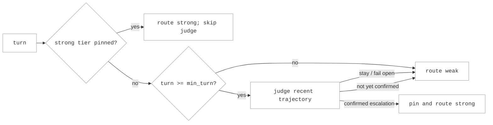

# Escalation-Router Routing

Escalation-router routing starts each conversation on a cheaper `weak` model.
An LLM judge watches how the work progresses and moves the conversation to a
more capable `strong` model when it detects sustained, recoverable trouble.
After escalation, the conversation stays on the strong tier for the rest of
the task.

Use it for multi-turn agent workloads where a weak model can handle routine
work but may need rescue after repeated errors, loops, drift, false progress,
or premature completion. Unlike
[LLM Classifier Routing](llm_classifier_routing.md), which predicts how
difficult a request looks, escalation routing judges whether the run is
actually going well.

## How it works

The router keeps one state value per conversation: whether that conversation
has escalated. Conversations are identified from the stable system prompt and
first user message, using the same bounded in-memory store described in
[Sticky Routing](sticky_routing.md).

For each turn, Switchyard:

1. Checks the conversation latch. A latched conversation routes to `strong`
   without calling the judge again.
2. Routes an unlatched conversation to `weak`. Before `judge.min_turn`
   (default `3`), it skips the judge because there is too little trajectory to
   assess.
3. Gives the judge a bounded summary containing the system and first-user
   anchors, recent messages, and a coverage note for omitted history.
4. Parses the judge's structured `escalate` decision. When the configured
   confirmation policy is satisfied, Switchyard pins the conversation to
   `strong` and uses the strong model for the current turn.
5. Fails open to `weak` when the judge times out, errors, or returns invalid
   output. A judge failure never creates a strong-tier pin.

The routing decision for one turn is:



## Confirmation policy

`judge.confirmations` controls how many positive verdicts are required before
the strong-tier latch fires:

- `confirmations: 1` is the default and escalates on the first positive
  verdict.
- `confirmations: 2` with `confirmation_window: 1` requires positive verdicts
  on consecutive judged turns.
- A larger `confirmation_window` allows recurring trouble to confirm even when
  negative verdicts occur between positive ones. A positive verdict remains
  live across at most `confirmation_window - 1` intervening negative verdicts.

A judge failure provides no evidence either way: it routes the turn to weak
without clearing an existing confirmation streak.

## Configure an escalation route

Escalation routing is currently available through the legacy `routes:` bundle
used by `--routing-profiles`. This path remains necessary for launcher-owned
routing; route bundles and `--routing-profiles` are otherwise deprecated in
favor of `switchyard serve --config` profiles.

```yaml
routes:
  agent-escalation:
    type: escalation_router
    fallback_target_on_evict: strong
    judge:
      model: google/gemini-3.5-flash
      api_key: ${OPENROUTER_API_KEY}
      base_url: https://openrouter.ai/api/v1
      timeout_secs: 5.0
      min_turn: 3
      confirmations: 1
      confirmation_window: 1
      recent_turn_window: 14
    weak:
      model: moonshotai/kimi-k2.6
      api_key: ${OPENROUTER_API_KEY}
      base_url: https://openrouter.ai/api/v1
    strong:
      model: anthropic/claude-opus-4.7
      api_key: ${OPENROUTER_API_KEY}
      base_url: https://openrouter.ai/api/v1
```

Run the route as a standalone proxy:

```bash
switchyard --routing-profiles routes.yaml -- serve --port 4000
```

Or use the same bundle with an agent launcher:

```bash
switchyard --routing-profiles routes.yaml -- launch claude
```

The route ID (`agent-escalation`) is the model ID clients select to use the
router. The strong and weak model IDs are also registered as direct
passthrough choices. The judge is internal to the route and is not exposed as
a client-selectable model.

If the selected tier exceeds its context window, Switchyard retries once on
`fallback_target_on_evict`, which must be `strong` or `weak`. See
[Context-Window Handling](../operations/context_window.md).

## Useful options

| Option | Default | Use it when |
|---|---|---|
| `judge.timeout_secs` | `5.0` | The judge needs a different wall-clock limit. Timeouts fail open to weak. |
| `judge.min_turn` | `3` | The judge should start earlier or wait for more trajectory evidence. |
| `judge.confirmations` | `1` | One positive verdict is too eager and escalation should require repeated evidence. |
| `judge.confirmation_window` | `1` | Intermittent trouble should remain eligible for confirmation across negative verdicts. |
| `judge.disable_reasoning` | `true` | Set to `false` when a reasoning judge benefits from thinking despite the added latency. |
| `judge.recent_turn_window` | `14` | The judge needs a wider or narrower trailing-message window. |
| `judge.window_message_chars` | `300` | More tool-output detail should survive per-message truncation. |
| `judge.max_request_chars` | `12000` | The complete judge request needs a different character budget. Oldest recent messages are dropped first. |
| `judge.prompt` | built-in | A deployment needs a custom escalation rubric inlined in the YAML. |
| `judge.prompt_path` | built-in | The custom rubric lives in a file (mutually exclusive with `judge.prompt`; relative paths resolve against the server's working directory). |
| `tier_timeout_s` | `600` | Strong or weak targets without their own `timeout_secs` need a different call timeout. |
| `enable_stats` | `true` | Set to `false` only when route-level usage statistics are not needed. |
| `affinity_max_sessions` | `10000` | A long-lived process needs a different in-memory latch capacity. |
| `session_key_depth` | `0` | Repeated benchmark trials with identical task prefixes need separate latches; keep `0` for normal traffic. |

## Observability

Read the standard routing stats endpoint:

```bash
curl -s http://localhost:4000/v1/routing/stats
```

The snapshot reports per-model calls, tokens, latency, and cost for the strong
and weak tiers. Judge calls are recorded in the classifier stats bucket so
their token cost, latency, and errors remain visible as routing overhead.

Each judged turn also writes an `escalation_verdict={...}` JSON line to server
stderr. The record includes the decision, reason, turn, confirmation state,
and judge latency. After the latch fires, later turns skip the judge and report
the pinned routing source in request metadata.

## Repeated benchmark trials

By default, the session key is derived from the system prompt and first user
message. Repeated trials of the same task against one long-lived server can
therefore share a latch: if the first trial escalates, later trials may start
on strong.

Use one of these isolation strategies:

- Start a fresh Switchyard process for each trial set.
- Set `session_key_depth: N` to extend the key with the first `N` messages
  after the initial user message. This only separates trials when those early
  trajectories differ, so it requires nonzero sampling temperature.

Keep `session_key_depth: 0` for normal traffic. Context compaction or other
mid-session prefix rewrites can change a deep key and lose the existing latch.

## When not to use escalation routing

- **One-shot requests.** There is no trajectory to judge. Use
  [LLM Classifier Routing](llm_classifier_routing.md) when the initial request
  should determine the tier.
- **Fixed traffic experiments.** Use
  [Random Routing](random_routing.md) for A/B splits and gradual traffic ramps.
- **Per-turn stage optimization.** Use
  [Stage-Router Routing](stage_router_routing.md) when tool-result signals
  should move individual turns in both directions.
- **Latency-critical traffic.** Eligible unlatched turns wait for the judge
  before the selected backend call.
- **Long-range failure cycles.** The judge only sees a bounded recent window;
  cycles longer than that window may be missed.

## Related

- [Routing Overview](overview.md): compare all supported routing strategies.
- [Sticky Routing](sticky_routing.md): session-key derivation and affinity
  behavior.
- [Architecture](../architecture.md): the end-to-end request lifecycle and
  system boundaries.
