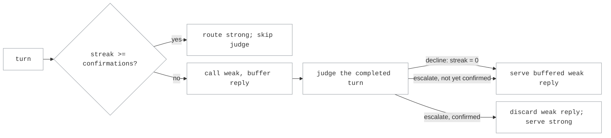

# Escalation-Router Routing

Escalation routing starts each conversation on a cheaper weak model. An LLM judge
reads how the work is going and latches the session to a strong model when it
detects sustained trouble. An optional de-escalation policy can later return the
session to the weak model.

Use it for multi-turn agent workloads where a weak model handles routine work but
may need rescue after repeated errors, loops, or drift. Unlike plain
[LLM Classifier Routing](llm_classifier_routing.md), which predicts how difficult
a request looks before running it, escalation judges whether the run is actually
going well.

## Configure an escalation route

```toml
schema_version = 1

[llm_clients.openrouter]
format = "openai_chat"
base_url = "https://openrouter.ai/api/v1"
api_key_env = "OPENROUTER_API_KEY"

[targets.judge]
id = "google/gemini-3.5-flash"
llm_client = "openrouter"

[targets.strong]
id = "anthropic/claude-opus-4.7"
llm_client = "openrouter"

[targets.weak]
id = "moonshotai/kimi-k2.6"
llm_client = "openrouter"

[routes.agent]
id = "agent"
type = "llm_classifier"
mode = "escalation"
classifier_target = "judge"
strong_target = "strong"
weak_target = "weak"
prompt = "Judge whether the weak model is stuck. Return the required structured verdict."
escalation = { confirmations = 2, recent_turn_window = 28, window_message_chars = 500 }
```

`classifier_target` is the judge. The route's `id`, `agent`, is the model name
clients send; the judge is not exposed as a client-selectable model.

The route-level `prompt` key replaces the packaged trajectory-judge prompt. It
uses the escalation verdict schema rather than the capability verdict schema.
Switchyard supplies that schema according to the route's `response_format_type`:
through the structured-output request in the default `json_schema` mode, or in
the prompt in `json_object` mode. When de-escalation is enabled, Switchyard
appends the phase-specific verdict contract to packaged and custom prompts.

## How the decision works

For each turn on an unlatched session, Switchyard:

1. Calls the weak target and buffers its reply.
2. Appends that reply to the transcript and asks the judge to rule on the
   completed turn. The judge therefore rates work the weak model actually did,
   not a prediction about work it might do.
3. Increments a consecutive-escalate streak on an escalate verdict, and resets it
   to zero on a decline.
4. Serves the buffered weak reply when the streak has not yet reached
   `confirmations` — so a judged turn that does not escalate costs one weak call
   plus one judge call, and no strong call.
5. Discards the buffered weak reply and serves the strong target instead once the
   streak reaches `confirmations`. That turn is billed for a weak call, a judge
   call, and a strong call.

By default, a latched session routes straight to the strong target with no
judge call:


```mermaid
%%{init: {"flowchart": {"nodeSpacing": 18, "rankSpacing": 26}}}%%
flowchart LR
    t["turn"] --> p{"streak >= confirmations?"}
    p -->|yes| s["route strong; skip judge"]
    p -->|no| c["call weak, buffer reply"]
    c --> j["judge the completed turn"]
    j -->|decline: streak = 0| w["serve buffered weak reply"]
    j -->|escalate, not yet confirmed| w
    j -->|escalate, confirmed| l["discard weak reply; serve strong"]

    classDef box font-family:monospace,fill:none,stroke:#9aa0a6,stroke-width:1px;
    class t,p,s,c,j,w,l box;
```

A judge that times out, errors, or returns an unparseable verdict fails open: the
turn serves the buffered weak reply and the existing streak is held rather than
cleared. A judge failure never creates a strong-tier latch.

## Judge model compatibility

The trajectory judge uses the same response contract and provider/model
compatibility guidance as the LLM classifier judge. See
[Judge model compatibility](llm_classifier_routing.md#judge-model-compatibility).

## Tuning options

The judge exposes three base settings. Their defaults are the benchmarked
configuration, so a bare `escalation = {}` is a valid, tuned route:

| Key | Default | Meaning |
|---|---|---|
| `confirmations` | `2` | Consecutive escalate verdicts required before the session latches to strong. Must be at least `1`. |
| `recent_turn_window` | `28` | Trailing messages shown to the judge on top of the anchors. Must be at least `1`. |
| `window_message_chars` | `500` | Per-message truncation cap inside that trailing window. Must be at least `50`. |

Replace the inline `escalation` value in the example with nested tables to make
escalation reversible:

```toml
[routes.agent.escalation]
confirmations = 2

[routes.agent.escalation.deescalation]
strong_min_calls = 3
confirmations = 2
strong_max_calls = 6
weak_cooldown_calls = 8
```

| De-escalation key | Required | Default | Meaning |
|---|:---:|---|---|
| `strong_min_calls` | Yes | — | Strong-tier turns before release is allowed. Must be at least `1`. |
| `confirmations` | Yes | — | Consecutive judge declines required to return to weak. Must be at least `1`. |
| `strong_max_calls` | No | unset | Hard limit on strong-tier turns before forced de-escalation. Must be at least `strong_min_calls`. |
| `weak_cooldown_calls` | No | `0` | Weak calls served without judging after a hard-limit return. |

With this table present, Switchyard marks judge input as either
`EFFICIENT_EVALUATION` or `STRONG_EVALUATION`. In the strong phase,
`escalate: true` keeps the strong tier. An `escalate: false` verdict can release
the next request only after `strong_min_calls` is reached and the configured
confirmation streak is complete. A timeout, error, or unparseable verdict
retains the strong tier. Omitting the table preserves the permanent latch and
does not add phase markers to judge input.

When `strong_max_calls` is set, the request after that many strong-tier turns returns
to weak even if the judge has not released it. `weak_cooldown_calls` then
prevents immediate re-escalation and avoids turn-by-turn bouncing.

If the strong target is unavailable during a review, the normal candidate
fallback may serve the weak target. Switchyard does not judge that fallback as a
strong answer, clears any partial release streak, and retries the strong phase
on the next turn.

`confirmations` is the main cost dial. `1` latches sooner and spends more on the
strong tier. `2` or higher requires a session identity, because the streak is
retained per session — without one, every turn starts from zero and the route
never latches. De-escalation also requires a session identity to retain its
phase and confirmation counts. Clients supply it with
`x-switchyard-session-id`.

When stateful escalation receives no session ID, Switchyard logs one warning per
route. The request still succeeds, but its temporary state cannot carry into the
next request.

Anchor and transcript caps remain fixed. Set the route-level
`max_output_tokens` key to change the judge's reply budget. Any decline still
resets the streak to zero.

## Run the route

After installing the Rust server, as described in
[Getting Started](../getting_started.md#install-the-server), export the provider
credential, validate the configuration, and start the binary:

```bash
export OPENROUTER_API_KEY="your-openrouter-key"  # pragma: allowlist secret
switchyard-server --config routes.toml --dry-run
switchyard-server --config routes.toml \
  --host 127.0.0.1 --port 4000
```

Send a request using the route ID, supplying a session identity so the streak
persists across turns:

```bash
curl http://localhost:4000/v1/chat/completions \
  -H "Content-Type: application/json" \
  -H "x-switchyard-session-id: demo-session" \
  -d '{"model":"agent","messages":[{"role":"user","content":"hello"}]}'
```

Invalid settings are rejected when the configuration loads rather than on the
first request, so `--dry-run` catches them.

## Observability

Read the standard stats endpoint:

```bash
curl -s http://localhost:4000/v1/stats
```

The snapshot reports per-model calls, tokens, latency, and cost for the strong
and weak tiers. Judge calls are recorded in the classifier stats bucket, so their
token cost and latency remain visible as routing overhead.

When the server runs with a routing log, successful judge calls also appear in
per-session routing stats under the judge's model id, tagged with the
`classifier` tier — so per-session token accounting includes judge overhead
alongside the tiers the session was served by.

## When not to use escalation routing

- **One-shot requests.** No trajectory to judge. Use
  [LLM Classifier Routing](llm_classifier_routing.md) in `capability` mode.
- **Traffic without session identity.** With `confirmations` above `1`, the route
  cannot accumulate a streak and never latches.
- **Fixed traffic experiments.** Use [Random Routing](random_routing.md).
- **Per-turn stage optimization.** Use
  [Stage-Router Routing](stage_router_routing.md) when signals should move
  individual turns in both directions.
- **Latency-critical traffic.** An unlatched turn waits for the weak call and then
  the judge call.

## Related

- [Routing Overview](overview.md): compare all supported routing strategies.
- [LLM Classifier Routing](llm_classifier_routing.md): pick a tier up front
  instead of judging the run.
- [Architecture](../architecture.md): the end-to-end request lifecycle and system
  boundaries.
