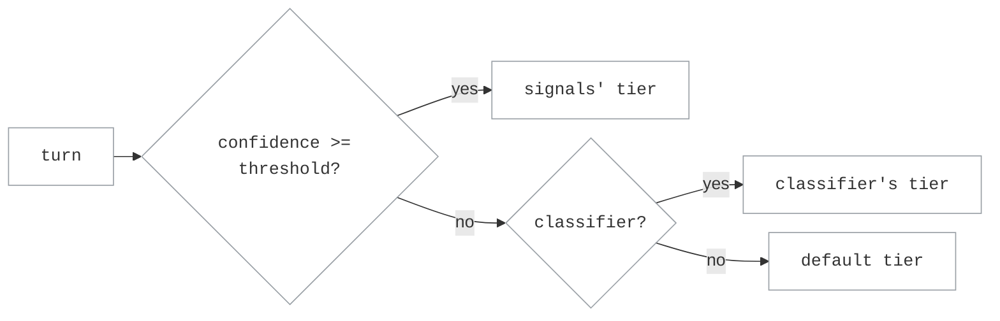

# Stage-Router Routing

Stage-router routing sends each request to either a **capable** model or a
cheaper **efficient** one, depending on where the agent is in its run. The goal
is to spend the capable model on the turns that need it (exploration, error
recovery, hard reasoning) and let the efficient model carry the routine,
mechanical work. Which tier a turn defaults to depends on the picker you choose
(`capable_first` or `efficient_first`); the signals then move individual turns
off that default. You configure it with a single knob, `confidence_threshold`,
plus an optional LLM classifier.

If the selected backend hits a context-window overflow, the router retries once
against `fallback_target_on_evict`; a second overflow surfaces a
context-pool-exhausted error (see [Context-Window Handling](../operations/context_window.md)).

## How it works

A coding agent's run moves through stages: early on it explores the codebase and
recovers from errors, and later it settles into more mechanical implementation.
Those stages call for different amounts of model capability, which is what the
router keys on.

For each LLM call, stage-router estimates which stage the agent is in from the
**tool-result history** on the conversation: whether writes and edits are
landing, whether tests pass, whether commands error out, how much read-only
exploration is happening, and how far into the run it is. It turns those signals
into a confidence score for "this turn needs the capable tier", then routes:

- the **capable** tier for uncertain, exploratory, or error-recovery turns, and
- the **efficient** tier for settled, mechanical turns.

`confidence_threshold` sets how sure that estimate must be before the router acts
on the signal alone. Below it, the turn stays on the picker's default tier (or,
if you added the optional classifier, goes to it first). A turn with no
tool-result history yet has no stage to estimate, so it takes the default tier.

The routing decision for one turn:



With `capable_first`, the default is capable, so a turn only reaches the cheaper
efficient model on a confident efficient signal (or an efficient verdict from
the classifier). Raising the threshold shrinks that path; lowering it widens it.

## Pickers

The picker name says which tier is the **default**: the tier used when the
signals are ambiguous and no classifier verdict is available.

- **`capable_first`**: capable is the default; drop to efficient only when the
  signals (or the classifier) clearly say so. Quality-first.
- **`efficient_first`**: efficient is the default; escalate to capable only when
  the signals (or the classifier) clearly say so. Cost-first.

Both pickers read the same signals; only the default tier differs.

## Tuning `confidence_threshold`

The scorer rates each turn from `0` (signals are neutral) to `1` (signals point
hard at one tier). `confidence_threshold` is the bar that rating has to clear
before the router will switch off the picker's default tier. Clear it and the
router routes to the tier the signals indicate; fall short and the turn stays on
the default.

With the default `capable_first` picker, every turn starts on the capable tier
and only drops to the efficient tier when the signals say "efficient" and clear
the threshold. So the threshold sets how much evidence it takes to switch to the
cheaper tier:

- Raise it and only strong, decisive signals drop a turn to efficient, so the
  router stays on capable longer (more quality, more cost).
- Lower it and weaker signals are enough to drop to efficient, so more turns go
  cheap (more savings, more risk).

`efficient_first` is the mirror: turns start on efficient and need a signal that
clears the threshold to escalate to capable.

(If you add the optional classifier, sub-threshold turns go to it instead of
staying on the default tier.)

**Set `0.5` explicitly.** It's the recommended starting point and is what the
example below uses. The default when you omit the field depends on which config
path you take:

| Configuration path | Default when omitted |
|---|---|
| Profile config (`switchyard serve --config`) | `0.7` |
| Deprecated route bundle (`--routing-profiles`) | `0.5` |

Rather than rely on either default, set `confidence_threshold: 0.5` yourself.

| `confidence_threshold` | Include `classifier:` block? | Typical use |
|---|---|---|
| `0.0` | no | Cost/latency-sensitive. Every signal-based verdict is accepted; no per-turn LLM call. Critical-error signals still escalate to capable. |
| `0.5` | no | Recommended starting point. A single strong signal clears the threshold on its own; derived from SWE-Bench Pro calibration. |
| `0.7` - `0.9` | yes | Classifier-assisted. Low-confidence turns go to the LLM classifier before falling back to the default tier. `0.7` is the profile-config default when the field is omitted. |
| `1.0` | yes (required) | Classifier-driven. Equivalent to the legacy `coding_agent` profile. |

The signal-vs-classifier split is dataset-dependent. Measure it in
production via `routing_decisions.stage_router` on `/v1/stats` rather than relying on
priors from this doc.

### Calibrating the threshold from run data

The recommended `0.5` starting point was derived from SWE-Bench Pro Python-75
calibration. To tune for a different task set or model pair, follow this
minimum-data path.

**What you need**

| Run | Coverage | Purpose |
|---|---|---|
| Pure-capable | ~40–75 representative tasks | Baseline outcomes + signal features |
| Pure-efficient | ~20 tasks (sampled from capable results) | Counterfactual outcomes |

Neither run needs to cover the full task set. A few dozen capable tasks gives
enough outcome diversity; the efficient probe only needs to cover the interesting
quadrant candidates identified from those capable results.

**How to sample the efficient probe set**

Stratify the pure-capable results across four quadrant candidates before running efficient:

| Category | Criterion | Count | Value |
|---|---|---|---|
| Easy + clean | Capable passes, small diff, clear spec | ~5 | Establishes SAFE floor |
| Easy + tricky | Capable passes, subtle logic | ~5 | Catches LOSS false-positives |
| Hard + structural | Capable fails, large multi-file diff | ~5 | HARD noise baseline |
| Hard + localized | Capable fails, small targeted fix | ~5 | Best RESCUE signal |

Sample across repos and diff sizes. Don't over-represent one project.

**Building RESCUE / LOSS quadrants**

From the overlap tasks (those with both capable and efficient results):

- `RESCUE` = capable-fail ∩ efficient-pass → escalation is beneficial here
- `LOSS`   = capable-pass ∩ efficient-fail → do NOT escalate here
- `SAFE`   = both pass
- `HARD`   = both fail

**Running the sweep**

Three scripts in `benchmark/calibration/stage_router/` form the pipeline:

| Script | Input | Output | What it does |
|---|---|---|---|
| `signal_extractor.py` | Harbor task dir (JSONL trajectory) | one signal per turn | Replays a claude-code session, emitting the same signal the stage-router picker would have seen at each turn (write/edit/read counts, severity, tests passed, etc.) |
| `calibrate.py` | Harbor run dirs (one per arm) | `per_task.jsonl`, `per_turn.jsonl` | Reads `result.json` + trajectory JSONL for each task in each arm. Calls `signal_extractor` to build per-turn signals, then writes one record per task (outcome + features) and one record per turn (signal snapshot). Also prints RESCUE/LOSS/SAFE/HARD quadrant counts. |
| `sweep.py` | `per_task.jsonl`, `per_turn.jsonl` | Console table | Replays the per-turn signals through a set of escalation policies and scores each: pass%, escalation rate. The best-scoring policy that keeps escalation rate reasonable is your calibrated threshold. |

```bash
cd benchmark/calibration/stage_router
python calibrate.py \
  --capable-run-dir /tmp/runs/your_capable_run \
  --efficient-run-dir /tmp/runs/your_efficient_probe
python sweep.py
```

`calibrate.py` writes `per_task.jsonl` and `per_turn.jsonl`. `sweep.py`
prints the policy score table; pick the best row from that output.

Pick the policy whose pass% beats `always_stay` with an acceptable
escalation rate. Translate it to a `confidence_threshold` value. A policy
that escalates ~20% of tasks maps roughly to `confidence_threshold: 0.5`
with `capable_first`.

Even 15–20 probe tasks produce a stable result because signal features are
extracted from the capable-arm trajectories, which are available for all
tasks from the pure-capable run.

**Caveat on efficient outcomes in stage-router vs. pure-efficient**

In stage-router, the efficient model may inherit partial context from the capable arm
(conversation history up to the escalation point). Pure-efficient runs start
fresh, so RESCUE is a conservative lower bound. Efficient performs at least as
well in stage-router as it does alone.

## Profile configuration

```yaml
endpoints:
  openrouter:
    base_url: https://openrouter.ai/api/v1
    api_key: ${OPENROUTER_API_KEY}

# Targets are named by the model id they serve.
targets:
  openai/gpt-4o:
    endpoint: openrouter
    model: openai/gpt-4o
    format: openai
  openai/gpt-4o-mini:
    endpoint: openrouter
    model: openai/gpt-4o-mini
    format: openai

profiles:
  smart-stage-router:
    type: stage_router
    picker: capable_first        # or efficient_first
    confidence_threshold: 0.5              # recommended; range [0.0, 1.0]
    signal_recent_window: 3                # sliding window for recent signal counts
    fallback_target_on_evict: openai/gpt-4o   # required; see Context-Window Handling
    capable: openai/gpt-4o                     # capable tier target id
    efficient: openai/gpt-4o-mini             # efficient tier target id
    enable_stats: true                     # default true
```

Save the file as `profiles.yaml` and start it with:

```bash
switchyard serve --config profiles.yaml --port 4000
```

This is the recommended default: routing on tool signals alone, no classifier.
If you omit `confidence_threshold`, the profile-config default of `0.7` applies;
the example sets `0.5` explicitly.

`fallback_target_on_evict` is required and must reference one of the
declared target ids. See [Context-Window Handling](../operations/context_window.md) for
exception types and error envelopes.

### Optional: add an LLM classifier

By default the router uses tool signals only. If you want a model to break the
tie on low-confidence turns, add a `classifier:` block and set
`confidence_threshold` above `0.0`. The classifier is consulted only for turns
that fall below the threshold:

```yaml
    classifier:
      model: openai/gpt-4o-mini
      api_key: ${OPENROUTER_API_KEY}   # prefer a separate key/quota in production
      base_url: https://openrouter.ai/api/v1
      timeout_secs: 30.0
      recent_turn_window: 3
```

Give the classifier its own credential or quota bucket where you can. Sharing
one provider bucket with the efficient tier adds a request per classified turn
and can cause sustained 429s at scale.

**Launcher compatibility.** Launcher subcommands don't accept `--config`. A
launcher-owned stage-router still needs the deprecated `--routing-profiles` path
and its legacy `routes:` schema. Use the same `type: stage_router`, picker,
target, classifier, and explicit `confidence_threshold: 0.5` values there.

## Observability

### Per-tier token / cost stats (standard)

```bash
curl http://localhost:4000/v1/stats
```

Returns the stats snapshot: per-model calls, tokens, latency, and cost, bucketed
by served model, each tagged with a `capable` or `efficient` `tier`. Batch
harnesses usually capture this same snapshot to a file (see below).

### Decision-source metadata (stage-router-specific)

The profile counts why each turn was routed the way it was, under
`routing_decisions.stage_router` in the stats JSON. For the `serve --config`
profile the values are:

| Source | When |
|---|---|
| `override` | A hard override fired (for example a critical error severity, or a clean test pass). |
| `dimensions` | The signals crossed `confidence_threshold` and picked the tier. |
| `llm-classifier` | The signals were ambiguous and the classifier returned a verdict. |
| `fall_open` | The signals were ambiguous and the classifier failed or wasn't configured, so the default tier was used. |
| `context_overflow_fallback` | A context-window overflow rerouted the turn to `fallback_target_on_evict`. |

The deprecated `--routing-profiles` path reports the same sources except
`context_overflow_fallback`, plus `no_signal` for turns that arrive before any
tool-result history exists.

To capture a snapshot for a batch run, redirect the endpoint to a file:

```bash
curl -s http://localhost:4000/v1/stats > routing_stats_final.json
```

## When *not* to use stage-router

- **Single-model deployments.** Use a plain passthrough profile instead.
- **Probabilistic A/B splits.** Use
  [Random Routing](random_routing.md) (`type: random-routing` in profile configs).
  The stage-router's signals are wasted on a fixed traffic ratio.
- **No tool-result history.** Stage-router needs meaningful tool-call traffic to
  populate the tool-result signal. For pure chat-completion workloads every
  ambiguous request lands on the picker's default tier.

## Related

- [Architecture](../architecture.md): the end-to-end request lifecycle and
  system boundaries.
