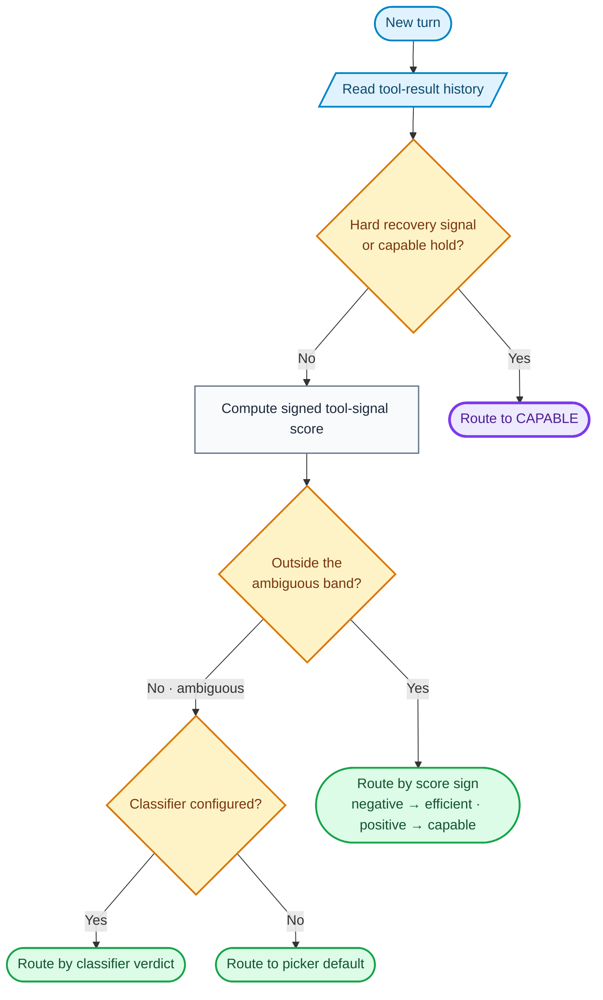

# Stage-Router Routing

**Execution** routing uses the stage router to choose a model from tool results
and agent progress. Configure it with `type = "stage_router"`.

Stage-router routing sends each request to either a **capable** model or a
cheaper **efficient** one, depending on where the agent is in its run. The goal
is to spend the capable model on the turns that need it (exploration, error
recovery, hard reasoning) and let the efficient model carry the routine,
mechanical work. Which tier a turn defaults to depends on the picker you choose
(`capable_first` or `efficient_first`); the signals then move individual turns
off that default. You configure it with a single knob, `confidence_threshold`,
plus an optional LLM classifier.

If the selected target exceeds its context window, the client tries the route's
remaining targets in configured order for that request. See
[Context-Window Handling](../operations/context_window.md).

## How it works

A tool-using agent's run moves through stages that call for different amounts of
model capability. The built-in vocabulary is calibrated for coding agents: it
recognizes file observation, mutation, planning, shell activity, and test results.

For each LLM call, stage-router estimates which stage the agent is in from the
**tool-result history** on the conversation, scoring two axes:

- **WRONG → capable**: `severity` (windowed error severity), `spinning` (deep
  churn with no reads or writes), and `exploring` (reading or planning without
  producing) push toward the capable tier.
- **PROGRESS → efficient**: `recent_production_intensity` (writes and edits
  landing over the recent window) pushes toward the efficient tier.

The axes are **corroborative**: the signed score is `tanh`-squashed to a
confidence in `[0, 1]`, so one full signal alone scores ~`0.46` and a second
corroborating signal is what pushes it decisively past a `0.5` threshold. A
repeated failures and critical-error severity are hard overrides that escalate. The router
then routes:

- the **capable** tier for uncertain, exploratory, or error-recovery turns, and
- the **efficient** tier for settled, mechanical turns.

`confidence_threshold` sets how sure that estimate must be before the router acts
on the signal alone. Below it, the turn stays on the picker's default tier (or,
if you added the optional classifier, goes to it first). A turn with no
tool-result history yet has no stage to estimate, so it takes the default tier.

The routing decision for one turn:


```mermaid
%%{init: {"flowchart": {"curve": "linear", "nodeSpacing": 36, "rankSpacing": 38}}}%%
flowchart TB
    start(["New turn"])
    history[/"Read tool-result history"/]
    recovery{"Hard recovery signal<br/>or capable hold?"}
    scorer["Compute signed tool-signal score"]
    band{"Outside the<br/>ambiguous band?"}
    classifier{"Classifier configured?"}
    capable(["Route to CAPABLE"])
    signalRoute(["Route by score sign<br/>negative → efficient · positive → capable"])
    classifierRoute(["Route by classifier verdict"])
    defaultRoute(["Route to picker default"])

    start --> history
    history --> recovery
    recovery -->|Yes| capable
    recovery -->|No| scorer
    scorer --> band
    band -->|Yes| signalRoute
    band -->|No · ambiguous| classifier
    classifier -->|Yes| classifierRoute
    classifier -->|No| defaultRoute

    classDef input fill:#e0f2fe,stroke:#0284c7,color:#0c4a6e,stroke-width:2px;
    classDef process fill:#f8fafc,stroke:#64748b,color:#1e293b,stroke-width:1.5px;
    classDef decision fill:#fef3c7,stroke:#d97706,color:#78350f,stroke-width:2px;
    classDef capable fill:#ede9fe,stroke:#7c3aed,color:#4c1d95,stroke-width:3px;
    classDef outcome fill:#dcfce7,stroke:#16a34a,color:#14532d,stroke-width:2px;

    class start,history input;
    class scorer process;
    class recovery,band,classifier decision;
    class capable capable;
    class signalRoute,classifierRoute,defaultRoute outcome;
```

With `capable_first`, the default is capable, so a turn only reaches the cheaper
efficient model on a confident efficient signal (or an efficient verdict from
the classifier). Raising the threshold shrinks that path; lowering it widens it.

## Pickers

The picker name says which tier is the **default**: the tier used when the
signals are ambiguous and no classifier verdict is available.

- **`efficient_first`**: efficient is the default; escalate to capable only when
  the signals (or the classifier) clearly say so. Cost-first.
- **`capable_first`** *(experimental)*: capable is the default; drop to efficient
  only when the signals (or the classifier) clearly say so. Quality-first.

Both pickers read the same signals; only the default tier differs.

!!! warning "`capable_first` is experimental"

    Every published threshold and routing result comes from `efficient_first`
    runs. `capable_first` works and the server accepts it, but it has not been
    benchmarked, so there are no calibrated thresholds for it and no measured
    accuracy or cost figures to set expectations against. The server logs a
    warning at startup when a route selects it. Use `efficient_first` unless you
    are running your own calibration.

## Tuning `confidence_threshold`

The tool-signal scorer gives each turn a signed score in `(-1, 1)`: negative
scores point to the efficient tier, positive scores point to the capable tier,
and the absolute value is the confidence. `confidence_threshold` creates a
closed **ambiguous band** from `-threshold` to `+threshold`. Scores outside the
band make a signal-based decision; scores inside it go to the optional
classifier or fall back to the picker's default tier.

The TOML schema requires you to choose `picker` explicitly; there is no implicit
default.

**Set `0.5` explicitly.** `confidence_threshold` is required by the TOML schema;
`0.5` is the recommended starting point, derived from many coding benchmarks,
and what the example below uses.

### What `0.5` means with `efficient_first`


With `picker = "efficient_first"`, no classifier, and a threshold of `0.5`:

- scores below `-0.5` route to efficient from the tool signals;
- scores from `-0.5` through `+0.5` are ambiguous and fall back to efficient;
- scores above `+0.5` route to capable from the tool signals.

Hard overrides and capable-hold state can still select capable independently of
this score. Lowering the threshold narrows the ambiguous band, so more turns are
decided directly by the scorer. Raising it widens the band, so more turns use the
picker default (or the classifier, when configured). That movement changes the
efficient/capable routing split.

| `confidence_threshold` | Include `classifier:` block? | Typical use |
|---|---|---|
| `0.0` | no | Cost/latency-sensitive. Every signal-based verdict is accepted; no per-turn LLM call. Critical-error signals still escalate to capable. |
| `0.5` | no | Recommended starting point, derived from many coding benchmarks. Signals outside the ambiguous band decide the tier; the rest use the picker default. |
| `0.7` - `0.9` | yes | Classifier-assisted. Low-confidence turns go to the LLM classifier before falling back to the default tier. |
| `1.0` | yes (for classifier-driven behavior) | Classifier-driven. Tool signals only apply hard overrides; other turns reach the classifier. |

A route with a `1.0` threshold remains valid without a classifier. In that case,
ordinary sub-threshold turns fall back to the picker's default tier; hard
overrides and capable-hold behavior still apply.

The signal-vs-classifier split is dataset-dependent. Measure it in
production: `/v1/stats` reports stage-router decisions by source and semantic
target, while response headers and structured decision logs explain individual selections.

### Calibrating the threshold from run data

Use about 10% of your representative tasks. Replay their agent histories through
the Stage tool-signal scorer and collect the raw signed score for every turn.
Plot that distribution, then overlay candidate ambiguous bands.

For `efficient_first`, count how many turns fall below the band, inside it, and
above it. Those three regions map directly to signal-selected efficient,
ambiguous/default-efficient, and signal-selected capable decisions when no
classifier is configured. Choose the threshold that gives the routing split you
want, then validate it on the same sample before running the full task set.

## Route configuration

> Requires unreleased features. [Build from source](../getting_started.md#build-from-source) to run this example.

```toml
schema_version = 1

[llm_clients.openrouter]
format = "openai_chat"
base_url = "https://openrouter.ai/api/v1"
api_key_env = "OPENROUTER_API_KEY"

[targets.strong]
id = "openai/gpt-4o"
llm_client = "openrouter"
# system_prompt = "diagnose before you edit"  # optional

[targets.weak]
id = "openai/gpt-4o-mini"
llm_client = "openrouter"
# system_prompt = "follow the settled plan"  # optional

[routes.stage]
id = "switchyard/stage"
type = "stage_router"
capable_target = "strong"
efficient_target = "weak"
picker = "efficient_first"
confidence_threshold = 0.5
recent_turn_window = 3          # optional, defaults to 3
capable_hold_turns = 2          # optional, defaults to 2
```

Save as `routes.toml` and start the server:

```bash
switchyard-server --config routes.toml --port 4000
```

This is the recommended default: routing on tool signals alone, no classifier.

### Optional: custom tool semantics

Extend the built-in coding vocabulary when an agent uses domain-specific tool
names. Mappings are route-scoped, additive, and matched by exact name without
regard to ASCII case:

```toml
[routes.stage.tool_semantics]
observe = ["KB_search", "get_customer_by_phone"]
mutate = ["send_payment_request", "update_inventory"]
plan = ["create_research_plan"]
new = ["start_conversation", "send_message_to_user"]
```

The categories affect existing stage signals:

- `observe` counts as investigation, like the built-in read and search tools.
- `mutate` counts as production, like the built-in write and edit tools.
- `plan` counts as investigation, like the built-in planning tools.
- `new` records forward activity that suppresses false `spinning` and
  `exploring` signals, but does not otherwise favor either tier.
- `unknown` remains the fallback for tools that match neither the built-in
  vocabulary nor configured semantics.

Configuration cannot reclassify a built-in tool. Empty names, duplicate names
across categories, and unknown category keys are rejected when the route is
loaded. Argument-aware wrapper tools, inferred semantics, and learned routing
rules are outside this exact-name configuration.

### Optional: handoff notes

Add a `[routes.stage.handoff_notes]` section to pass a contextual note to the
model the router switches to. The escalation note is sent to the capable tier on
a signal-driven escalation; the de-escalation note is sent when the scorer
decisively picks the efficient tier.

```toml
[routes.stage.handoff_notes]
escalation_note = "the previous model was stalling; pick up the diagnosis"
# deescalation_note = "..."          # optional
# only_on_wrong_signal_escalation = true  # default; set false to always send
```

### Optional: LLM classifier fallback

The block is optional, and omitting it is the default. With no
`[routes.stage.classifier]` block there is no judge and no fallthrough to one:
a turn the signals leave undecided goes straight to the `picker` tier.

To break ties on low-confidence turns with a model call, add the block and set
`confidence_threshold` above `0.0`. The classifier is consulted only for turns
that fall below the threshold:

```toml
[routes.stage.classifier]
target = "strong"          # target the judge is called through (not a routing destination)
base_threshold = 0.5       # p_solve floor to route efficient; below this → capable
threshold_step = 0.1       # adds 0.1 for uncertain and 0.2 for unsupported verdicts
recent_turn_window = 3     # conversation span the judge sees
prompt = "Estimate whether the efficient target can complete this request."
response_format_type = "json_object"  # optional; default is "json_schema"
```

`prompt` replaces the packaged capability-classifier prompt. In the default
`json_schema` mode, Switchyard sends the verdict schema through the structured-output
request. Set `response_format_type = "json_object"` for providers that only support
JSON Object mode; Switchyard then adds the schema to the judge prompt and validates
the returned object locally. The verdict schema and routing thresholds remain unchanged.

Leave the block out under
[Composite Routing](composite_routing.md). There the tier is already picked
at the user turn, so a fallthrough judge would sit between the signals and that
decision and overrule it.

Give the classifier its own LLM client or quota bucket where possible. Sharing
one provider bucket with the efficient tier adds a request per classified turn
and can cause sustained 429s at scale.

## Observability

When a model serves the request, the response identifies it with this routing
header:

| Header | Content |
|---|---|
| `x-model-router-selected-model` | The model ID the turn was routed to. |

### Decision sources

The router records an internal `decision_source` for each turn to distinguish the
paths through its cascade:

| Source | When |
|---|---|
| `override` | A repeated failure, critical-error severity, or context-compaction marker forced the capable tier. Structured logs set `override_reason` to `repeated_failure`, `critical_error`, or `compaction`. |
| `capable_hold` | A recent escalation kept this recovery turn on the capable tier. |
| `dimensions` | The corroborative scorer crossed `confidence_threshold` and picked the tier by the sign of the score. |
| `llm-classifier` | The signals were ambiguous and the classifier returned a verdict. |
| `fall_open` | The signals were ambiguous and the classifier failed or wasn't configured; the default tier was used. |

## When *not* to use stage-router

- **Single-model deployments.** Use a `passthrough` route instead.
- **Probabilistic A/B splits.** Use
  [Random Routing](random_routing.md) (`type = "random"`).
  The stage-router's signals are wasted on a fixed traffic ratio.
- **No tool-result history.** Stage-router needs meaningful tool-call traffic to
  populate the tool-result signal. For pure chat-completion workloads every
  ambiguous request lands on the picker's default tier.

## Related

- [Architecture](../architecture.md): the end-to-end request lifecycle and
  system boundaries.
