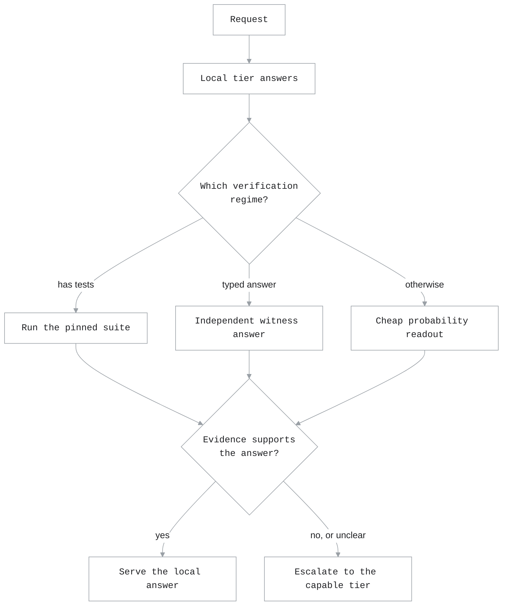

# Verification-Gated Routing

Every other strategy here decides *before* the answer exists, or asks a second
model for its *opinion* of one. A classifier reads the request and predicts which
tier should serve it. A stage router reads tool-result history as a proxy for how
hard the turn is. An escalation judge reads the finished transcript and gives a
verdict. All of them are guesses, however well-informed.

Verification-gated routing decides on **evidence about the answer that was
actually produced**: a test suite that passed or failed, agreement between the
attempt's stated answer and an independently produced one, the tool-error record
of the turn. The cheap tier answers first, and its answer is committed only when
something a model cannot talk its way around says it should be.

Use it when a wrong answer is expensive, the cheap tier is often right but not
reliably so, and you have something better than an opinion to check against.

Compare with [Escalation-Router Routing](escalation_router_routing.md), which is
the closest relative: it also serves the weak tier first, but gates on a judge's
opinion of the transcript rather than on evidence about the answer.

## How it works



Evidence is gathered cheapest-first and stops as soon as a commit is licensed, so
a turn the four-token readout can settle never pays for a cloud call.

The router is **fail-closed**. Evidence that is missing, timed out, malformed, or
contradictory never produces a local commit — it escalates. That is the opposite
default from every other strategy here, and it is deliberate: the whole point is
that a local answer is served only when something affirmatively supports it.

## Decide first, serve later

`mode` separates what the router *concludes* from what your deployment *acts on*,
so you can measure it against real traffic before it routes anything:

| Mode | Decides | Serves |
|---|---|---|
| `off` | no | capable tier, always. Spends nothing. |
| `shadow` | yes | capable tier, always. Full decision records at no routing risk. |
| `evaluate` | yes | the *ungated* decision. Isolated measurement only. |
| `active` | yes | the readiness-gated decision. |

The public `switchyard-server` runner supports all four modes. `active` requires
the exact approval attestation `prospective-validation-and-canary-approved` and
serves only the route that passes the readiness gates. Active mode does not add
native privacy/no-egress enforcement or an operator runtime kill switch;
deployments that require those controls must provide them outside the runner.

## Configure a verification-gated route

```toml
schema_version = 1

[llm_clients.openrouter]
format = "openai_chat"
base_url = "https://openrouter.ai/api/v1"
api_key_env = "OPENROUTER_API_KEY"

[targets.local]
id = "openai/gpt-4o-mini"
llm_client = "openrouter"

[targets.cloud]
id = "openai/gpt-4o"
llm_client = "openrouter"

[routes.vgr]
id = "switchyard/vgr"
type = "vgr"
local_target = "local"
cloud_target = "cloud"
mode = "shadow"                 # safe public-runner measurement mode
task_typing = true              # default; set false to opt out
deadline_seconds = 30
```

To enable live routing after evaluation, set:

```toml
mode = "active"
active_approval = "prospective-validation-and-canary-approved"
```

`local_target` and `cloud_target` must resolve to different model IDs. Target
names and client names do not distinguish them: the runtime client router is
keyed only by model ID.

When the local backend reports its live context capacity, VGR republishes it
through `/v1/models`.

## Tuning options

| Key | Default | Meaning |
|---|---|---|
| `judge_target` | local tier | Answers the cheap local rungs. Never routed to. |
| `cloud_judge_target` | unset | Answers the cloud confirmation rungs. Unset removes them. Never routed to. |
| `deadline_seconds` | `30` | Budget for the whole decision. What is not established in time escalates. |
| `task_typing` | `true` | One cheap local call that types the request. Set `false` to opt out; without it the answer and conversational regimes are unreachable. |
| `latch_escalation` | `false` | Once a session escalates, later turns skip verification and stay on the capable tier. |
| `speculation_carry` | `false` | Escalation carries the rejected attempt forward as unverified reference. Helps on research-style work, hurts on conversational. |
| `structured_answer` | `false` | Declares a schema-validated terse answer format, the only surface where typed agreement counts. |
| `breaker_threshold` | `5` | Consecutive local-tier failures that stop it being called. |
| `breaker_cooldown_seconds` | `30` | How long before one trial request is allowed through. |

Commit thresholds are not route settings. They are a jointly-selected operating
point, and exposing them per route would let one be de-tuned in isolation.

## Policy and tool evidence

Switchyard records this Rust policy as `1.0.0`, the first policy identity
established for the library. Its decision behavior is synchronized with the
reference POLICY 2.11 shipment: the branch dials are coding `0.2`, chat `0.3`,
answer `0.7`, default `0.7`, and agentic `0.2`; the coding dial arm additionally
requires a strict cloud-judge affirmation.

Agentic commits use the tool record derived from normalized request history. A
bounded recovered run may relax an earlier-error veto when that history reports
at least one error, no more than 15 tool results, and a clean final result.
Missing, malformed, or contradictory summaries never authorize.

The native `switchyard-server` deliberately trusts transcript tool results as
Host evidence even though it does not execute the tools. This enables agentic
local commits through the normal proxy API, but any client that can submit
conversation history can also report a clean tool record.

For agentic sessions, the judged view contains user task text, the bounded
assistant/tool trajectory, and the current attempt. System and developer
instructions are treated as agent-framework boilerplate and omitted from this
view; non-agentic coding and general views continue to require their instruction
content to fit without clipping.

Tool-bearing assistant turns also use in-flight trajectory verification. Two
consecutive escalation votes latch the session to the capable tier; a definite
decline clears the streak, while an ambiguous or failed judgment stays fail-open.
The four-token readout requests `reasoning_effort = "none"` for that verifier call
only; ordinary agent calls keep the reasoning mode of the same loaded model.
Turns without tool calls pay nothing for this in-flight check, and a latched
session makes no further local or judge calls.

## Checking against a test suite

When a task ships tests, running them is the strongest evidence available —
ground truth rather than an opinion. Add a `[checker]` table:

```toml
[routes.vgr.checker]
tests_dir = "/srv/suites/billing"
materialize_command = ["/usr/local/bin/materialize-vgr-candidate"]
command = ["/usr/bin/pytest", "-q", "-p", "no:cacheprovider", "{tests}"]
sandbox_attestation = "vgr-checker-runs-in-deployment-sandbox"
validated = true
```

The trusted materializer reads the attempt and task from `ATTEMPT_FILE` and
`TASK_FILE`, then writes candidate sources under `WORKSPACE_DIR`. It receives no
inherited environment or test-suite path. The separate checker command runs
from that candidate workspace. Both settings are argv lists; a shell runs only
when the operator explicitly configures one.

The suite is snapshotted and hashed at startup, then re-verified before the run
and again before any pass is reported — because the attempt runs as the same
user as the tests grading it, and nothing else stops it rewriting its own exam.
In public-runner measurement, `evaluate` exposes the raw checker decision while
`shadow` still serves cloud. In Active, only a validated pass satisfies the
readiness gate; an unvalidated or tampered suite serves cloud.

Two constraints follow from that:

- **The command must not write into `tests_dir`.** A suite that drops
  `__pycache__` there is indistinguishable from one that edited itself, and the
  run reports no verdict. Disable bytecode caching, as above.
- **Use native command paths.** The checker runs on Unix and Windows, but its
  argv lists are not translated. Configure Windows deployments with native
  executables and paths. Windows Job Objects preserve whole-process-tree
  cancellation semantics.

Resource limits, network isolation and filesystem confinement are **not**
provided here; run the deployment inside a sandbox that enforces them. The
attestation string records that you have.

## Run the route

```bash
export OPENROUTER_API_KEY="your-openrouter-key"  # pragma: allowlist secret
switchyard-server --config routes.toml --dry-run
switchyard-server --config routes.toml \
  --host 127.0.0.1 --port 4000
```

```bash
curl http://localhost:4000/v1/chat/completions \
  -H "Content-Type: application/json" \
  -d '{
    "model": "switchyard/vgr",
    "messages": [{"role": "user", "content": "What is the capital of France?"}]
  }'
```

The `x-model-router-selected-model` response header names the tier that served
the turn, so you can see commits and escalations without reading logs.
`x-switchyard-route-type` identifies the configured routing algorithm as `vgr`;
diagnostic passthrough routes report `passthrough` instead. The same value is
available as `route_type` on both model-card formats returned by `GET /v1/models`.
