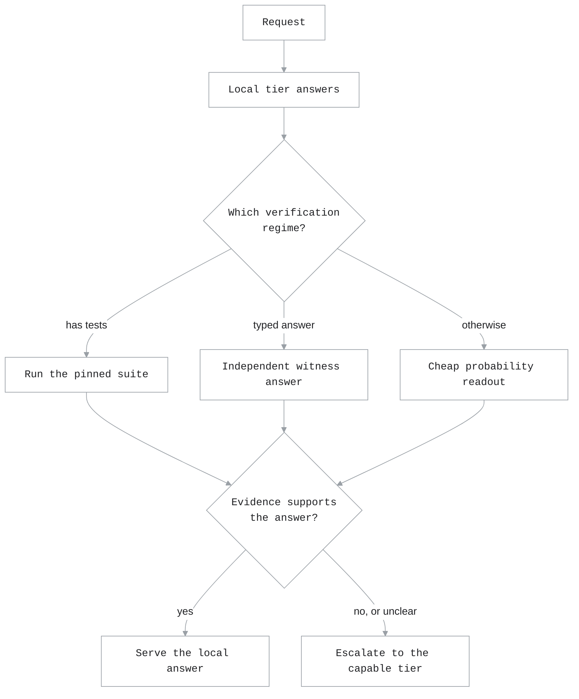

# Verification-Gated Routing

Every other strategy here decides *before* the answer exists, or asks a second
model for its *opinion* of one. A classifier reads the request and predicts which
tier should serve it. A stage router reads tool-result history as a proxy for how
hard the turn is. An escalation judge reads the finished transcript and gives a
verdict. All of them are guesses, however well-informed.

Verification-gated routing decides on **evidence about the answer that was
actually produced**: a test suite that passed or failed, agreement between the
attempt's stated answer and an independently produced one, the tool-error record
of the turn. The cheap tier answers first, and its answer is committed only when
something a model cannot talk its way around says it should be.

Use it when a wrong answer is expensive, the cheap tier is often right but not
reliably so, and you have something better than an opinion to check against.

Compare with [Escalation-Router Routing](escalation_router_routing.md), which is
the closest relative: it also serves the weak tier first, but gates on a judge's
opinion of the transcript rather than on evidence about the answer.

## How it works


```mermaid
%%{init: {'theme':'base','themeVariables':{'fontFamily':'monospace','primaryColor':'#ffffff','primaryTextColor':'#202124','primaryBorderColor':'#9aa0a6','lineColor':'#9aa0a6'}}}%%
flowchart TD
    A[Request] --> B[Local tier answers]
    B --> C{Which verification<br/>regime?}
    C -->|has tests| D[Run the pinned suite]
    C -->|typed answer| E[Independent witness answer]
    C -->|otherwise| F[Cheap probability readout]
    D --> G{Evidence supports<br/>the answer?}
    E --> G
    F --> G
    G -->|yes| H[Serve the local answer]
    G -->|no, or unclear| I[Escalate to the capable tier]
    class A,B,C,D,E,F,G,H,I box;
    classDef box font-family:monospace,fill:none,stroke:#9aa0a6,stroke-width:1px;
```

Evidence is gathered cheapest-first and stops as soon as a commit is licensed, so
a turn the four-token readout can settle never pays for a cloud call.

The router is **fail-closed**. Evidence that is missing, timed out, malformed, or
contradictory never produces a local commit — it escalates. That is the opposite
default from every other strategy here, and it is deliberate: the whole point is
that a local answer is served only when something affirmatively supports it.

## Decide first, serve later

`mode` separates what the router *concludes* from what your deployment *acts on*,
so you can measure it against real traffic before it routes anything:

| Mode | Decides | Serves |
|---|---|---|
| `off` | no | capable tier, always. Spends nothing. |
| `shadow` | yes | capable tier, always. Full decision records at no routing risk. |
| `evaluate` | yes | the *ungated* decision. Isolated measurement only. |
| `active` | yes | Library embedders only: the decision, subject to readiness gates. Rejected by the public runner. |

The public `switchyard-server` runner supports `off`, `shadow`, and `evaluate`
for measurement. It rejects `active` at startup, even with the library approval
attestation, until native privacy/no-egress enforcement and an operator runtime
kill switch are wired. Library embedders that supply both controls can use
`ServingMode::Active`; its exact approval attestation is
`prospective-validation-and-canary-approved`.

## Configure a verification-gated route

```toml
schema_version = 1

[llm_clients.openrouter]
format = "openai_chat"
base_url = "https://openrouter.ai/api/v1"
api_key_env = "OPENROUTER_API_KEY"

[targets.local]
id = "openai/gpt-4o-mini"
llm_client = "openrouter"

[targets.cloud]
id = "openai/gpt-4o"
llm_client = "openrouter"

[routes.vgr]
id = "switchyard/vgr"
type = "vgr"
local_target = "local"
cloud_target = "cloud"
mode = "shadow"                 # safe public-runner measurement mode
task_typing = true              # default; set false to opt out
deadline_seconds = 30
```

`local_target` and `cloud_target` must resolve to different model IDs. Target
names and client names do not distinguish them: the runtime client router is
keyed only by model ID.

## Tuning options

| Key | Default | Meaning |
|---|---|---|
| `judge_target` | local tier | Answers the cheap local rungs. Never routed to. |
| `cloud_judge_target` | cloud tier | Answers the cloud confirmation rungs. An explicit target overrides the capable tier. Never routed to. |
| `deadline_seconds` | `30` | Budget for the whole decision. What is not established in time escalates. |
| `task_typing` | `true` | One cheap local call that types the request. Set `false` to opt out; without it the answer and conversational regimes are unreachable. |
| `latch_escalation` | `false` | Once a session escalates, later turns skip verification and stay on the capable tier. |
| `speculation_carry` | `false` | Escalation carries the rejected attempt forward as unverified reference. Helps on research-style work, hurts on conversational. |
| `structured_answer` | `false` | Declares a schema-validated terse answer format, the only surface where typed agreement counts. |
| `breaker_threshold` | `5` | Consecutive local-tier failures that stop it being called. |
| `breaker_cooldown_seconds` | `30` | How long before one trial request is allowed through. |

Commit thresholds are not route settings. They are a jointly-selected operating
point, and exposing them per route would let one be de-tuned in isolation.

## Policy and tool evidence

Switchyard records this Rust policy as `1.0.0`, the first policy identity
established for the library. Its decision behavior is synchronized with the
reference POLICY 2.11 shipment: the branch dials are coding `0.2`, chat `0.3`,
answer `0.7`, default `0.7`, and agentic `0.2`; the coding dial arm additionally
requires a strict cloud-judge affirmation.

Agentic commits require tool evidence from a server-owned executor. A bounded
recovered run may relax an earlier-error veto only when that executor attests at
least one error, no more than 15 tool results, and a clean final result. Missing,
malformed, request-derived, or contradictory summaries never authorize.

The native `switchyard-server` does not execute tools. Tool results found in
request history are therefore marked **Untrusted**: they may veto a commit, but
cannot authorize one. Consequently native-runner agentic branches never serve
locally. Only an integration whose server-owned executor produced the execution
log may set Host provenance; client headers, metadata, and message fields must
never do so.

Tool-bearing assistant turns also use in-flight trajectory verification. Two
consecutive escalation votes latch the session to the capable tier; a definite
decline clears the streak, while an ambiguous or failed judgment stays fail-open.
Turns without tool calls pay nothing for this in-flight check, and a latched
session makes no further local or judge calls.

## Checking against a test suite

When a task ships tests, running them is the strongest evidence available —
ground truth rather than an opinion. Add a `[checker]` table:

```toml
[routes.vgr.checker]
tests_dir = "/srv/suites/billing"
materialize_command = ["/usr/local/bin/materialize-vgr-candidate"]
command = ["/usr/bin/pytest", "-q", "-p", "no:cacheprovider", "{tests}"]
sandbox_attestation = "vgr-checker-runs-in-deployment-sandbox"
validated = true
```

The trusted materializer reads the attempt and task from `ATTEMPT_FILE` and
`TASK_FILE`, then writes candidate sources under `WORKSPACE_DIR`. It receives no
inherited environment or test-suite path. The separate checker command runs
from that candidate workspace. Both settings are argv lists; a shell runs only
when the operator explicitly configures one.

The suite is snapshotted and hashed at startup, then re-verified before the run
and again before any pass is reported — because the attempt runs as the same
user as the tests grading it, and nothing else stops it rewriting its own exam.
In public-runner measurement, `evaluate` exposes the raw checker decision while
`shadow` still serves cloud. For library embedders using Active, only a validated
pass satisfies the readiness gate; an unvalidated or tampered suite serves cloud.

Two constraints follow from that:

- **The command must not write into `tests_dir`.** A suite that drops
  `__pycache__` there is indistinguishable from one that edited itself, and the
  run reports no verdict. Disable bytecode caching, as above.
- **The checker is Unix-only.** The table is accepted everywhere so configuration
  stays portable, but building one on Windows reports it as unsupported.

Resource limits, network isolation and filesystem confinement are **not**
provided here; run the deployment inside a sandbox that enforces them. The
attestation string records that you have.

## Run the route

```bash
export OPENROUTER_API_KEY="your-openrouter-key"  # pragma: allowlist secret
switchyard-server --config routes.toml --dry-run
switchyard-server --config routes.toml \
  --host 127.0.0.1 --port 4000
```

```bash
curl http://localhost:4000/v1/chat/completions \
  -H "Content-Type: application/json" \
  -d '{
    "model": "switchyard/vgr",
    "messages": [{"role": "user", "content": "What is the capital of France?"}]
  }'
```

The `x-model-router-selected-model` response header names the tier that served
the turn, so you can see commits and escalations without reading logs.
