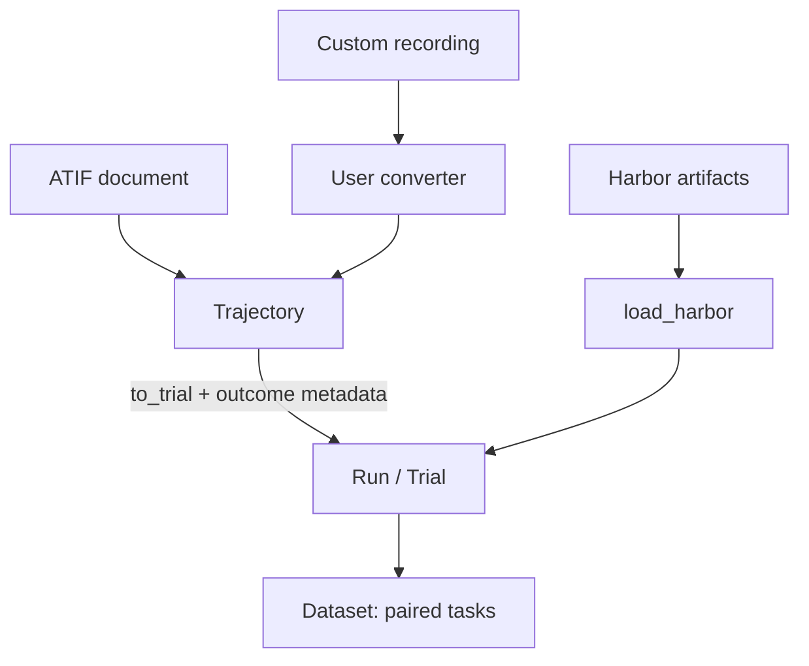
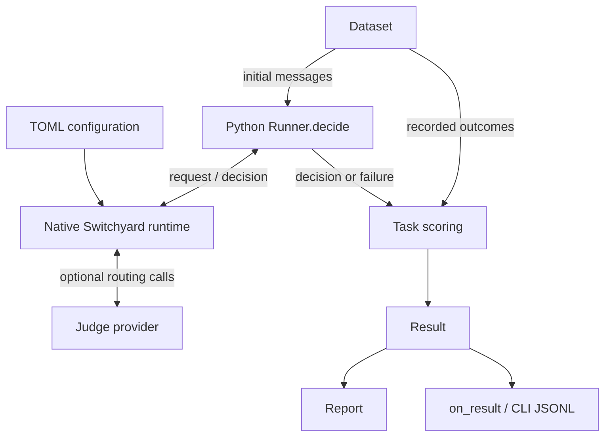

# Switchyard-Sim architecture

`switchyard.sim` helps users compare Switchyard routing policies on their own
recorded workflows. It routes the input available before a task starts, then
scores the selected target using completed runs of that task. The simulator is
Python; routing executes through Switchyard's public Python interface and existing
native runtime. Both run in the same process.

See the [evaluation guide](simulation.md) for installation, runnable examples,
import rules, and metric definitions. This page describes the implemented task
evaluator and the boundary available for future trajectory replay.

## Data flow

Importers converge on trials before task pairing. Custom converters retain a full
ATIF document in `Trajectory`; Harbor projects directly from its artifact files.

`evaluate` schedules tasks through the following flow. The two dataset edges
separate what the router sees from the evidence used to score its choice.

Recorded rewards and completed agent steps stay outside the routing request.
Fixed and random routes need no provider calls. A classifier may call its judge;
the task evaluator does not run the selected completion model, agent environment,
or verifier. Its score is an estimate from comparable recorded runs.

## Components and ownership

| Component | Owns |
| --- | --- |
| [`trajectory.py`](../switchyard/sim/trajectory.py) | An independent copy of a full ATIF document; extraction of initial text messages; projection into a `Trial` with explicit identity and outcome metadata. |
| [`harbor.py`](../switchyard/sim/harbor.py) | Harbor artifact discovery, validation, verifier/accounting metadata, and import issues. It uses the shared initial-input projection directly, avoiding a second copy of the full trajectory. |
| [`models.py`](../switchyard/sim/models.py), [`dataset.py`](../switchyard/sim/dataset.py) | `Trial`, `Run`, `Task`, `Outcome`, and `Result`; task pairing, comparable-input checks, repeat aggregation, and selection of the routing input. |
| [`evaluate.py`](../switchyard/sim/evaluate.py) | Route compatibility checks, bounded asynchronous scheduling, deadlines, isolated task sessions, scoring, and progressive result delivery. Public `score(task, decision)` exposes the same scoring rules without making calls. |
| [`switchyard.runner`](../switchyard/runner.py), [Python bindings](../switchyard_rust/runner.py) | The public normalized decision API and asynchronous bridge into the existing runtime. Simulation uses this interface rather than duplicating routing configuration or algorithms. |
| [Native runner](../crates/switchyard-runner/src/runner.rs), [routing algorithms](../crates/libsy/src/lib.rs) | Configuration, routing state, algorithms, and routing-time calls through Switchyard's clients and format translation. |
| [`report.py`](../switchyard/sim/report.py), [CLI](../switchyard/sim/__main__.py) | Incremental metrics and coverage; the CLI adds a manifest, flushed result rows, and a final report. |

Artifact conversion, pairing, and report aggregation use the Python standard
library. The native runtime is needed when making routing decisions. Harbor is
an input format, not an installed dependency.

## From recordings to one scored task

1. **Import evidence.** A trial contains the original initial messages, target,
   task and trial identities, recorded model, and available reward, cost, duration,
   and usage. Unknown measurements stay unknown. Imports fail by default;
   tolerant importers retain rejected records in `Run.issues`.
2. **Build a comparable cohort.** `Dataset.from_runs` validates task identity and
   input compatibility. Pairing requires matching task sets by default; explicit
   intersection records exclusions. Outcomes average repeats within each
   task/target. Tasks have equal weight in the report. `input_target` chooses which
   run supplies the routing input; repeats use the first string-sorted trial ID.
3. **Validate and route.** `evaluate` checks the route's targets and known model
   identities before scheduling work. Each task gets a copied initial request,
   a distinct final-session ID, and a deadline covering the complete decision.
   `Runner.decide(..., allow_response=False)` returns a selection, fallback
   choices, decision evidence, and completed routing-call observations.
4. **Score the selection.** The scorer checks that the decision can be matched to
   recorded outcomes, including model identity and visible conversation changes.
   It attaches the selected target's outcome and all fixed-target baselines to a
   `Result`. Routing failures and unsupported selections become error results in
   `evaluate`; standalone `score` rejects unsupported decisions with `ValueError`.
5. **Report progressively.** The coordinator adds each result to `Report`, then
   invokes the synchronous `on_result` callback. Routing telemetry and costs stay
   separate from recorded task estimates. Matched comparisons use their stated
   observed cohorts; missing reward or cost is never treated as zero.

`evaluate` and `score` share internal scoring routines. Applications that already
own scheduling can use `Runner.decide`, `score`, and `Report.add` directly.

## Extension boundaries

### Custom formats use ATIF

A converter is a plain function returning `Trajectory`. It translates the source
format into ATIF; `Trajectory.to_trial` extracts task input using the same rules as
Harbor. The caller supplies task identity, outcomes, and recorded model metadata
explicitly. The [converter example](simulation.md#use-atif-or-custom-recordings)
shows the complete path into `Run` and `Dataset`.

`Trajectory` preserves all steps and extension fields for other consumers.
`to_trial` retains only initial input and supplied metadata. Validation covers the
ATIF version, steps container, and fields read for input projection; it is not a
complete ATIF schema validator. Initial copied continuation context requires the
original task input to replace it. Unmarked leaked context remains the converter
author's responsibility.

### Routing, pricing, and result storage

Configure routing policies through Switchyard's existing TOML and `Runner`.
Adding a format converter does not require a new routing algorithm. Supplying a
`price_call` function lets a library caller estimate routing-call cost from its
own rates and observed usage; the simulator has no built-in pricing catalog.
Use `on_result` for a dashboard or an application-owned result store.

### Future trajectory replay

Replay is not implemented. Full ATIF documents and the public decision API provide
the reusable boundaries: a replay coordinator could construct successive
histories, call the same `Runner`, and pass execution results to a replay-specific
scorer. It would also need to own environment state, tool execution, session
ordering, verification, and recovery.

Recorded task outcomes cannot establish what happens after a mid-trajectory model
switch. That requires new execution or a separately validated replay method.
Keeping replay outside the current task scorer avoids assigning recorded rewards
to behavior that never occurred.

## Operational contracts

- **Memory:** Harbor decodes one full trajectory at a time. A dataset retains the
  included trials and initial inputs across targets and repeats. `Report` retains
  aggregates and seen task IDs, not result rows. Concurrency bounds active
  decisions, not dataset memory. Release unused `Run` objects after pairing.
- **State and concurrency:** use a fresh `Runner` for independent experiments.
  Task sessions are distinct and final. Seeded random routing requires serial
  evaluation when task-to-draw assignment must be reproducible. One decision may
  make several routing-time provider calls.
- **Failure handling:** callback errors and cancellation stop scheduling and drain
  pending local work. Already received provider requests cannot be revoked. Keep
  callbacks short; applications that queue writes must handle their completion.
- **Artifacts:** the CLI writes into a new output directory outside the inputs.
  Its manifest records configuration identity and import options; JSONL rows are
  flushed as tasks finish. Partial output remains inspectable after interruption.
  There is no automatic resume. See [saved artifacts](simulation.md#save-progressive-results).
- **Validity:** the caller must establish equivalent task, agent, model, and
  provider settings across recordings. The scorer checks the normalized decision
  request, not every transport-time provider override. See
  [library boundaries](simulation.md#library-boundaries) before interpreting
  comparisons as workflow improvements.
