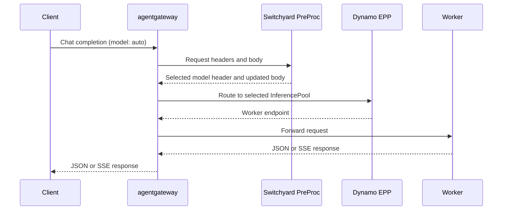

<!--
SPDX-FileCopyrightText: Copyright (c) 2025-2026 NVIDIA CORPORATION & AFFILIATES. All rights reserved.
SPDX-License-Identifier: Apache-2.0
-->

# Switchyard PreProc for Dynamo

Run Switchyard as a separate ExtProc service behind agentgateway 1.0.0. The gateway sends
an OpenAI Chat Completions request to PreProc before matching its HTTPRoute. Switchyard
chooses the model; the selected model's Dynamo EPP chooses the worker.



This directory owns the service, tests and image build. The
[Dynamo deployment example](https://github.com/ai-dynamo/dynamo/tree/main/examples/backends/vllm/deploy/gaie/switchyard)
owns the Kubernetes manifests and model-pool bindings. It assumes the cluster, gateway
controller, model workers and EPPs are already installed.

## Build the image

From the Switchyard repository root, use Docker to build and publish an image to a registry
your cluster can pull from:

```bash
export PREPROC_IMAGE=registry.example.com/your-project/switchyard-preproc:example
docker build -t "$PREPROC_IMAGE" examples/dynamo-preproc
docker push "$PREPROC_IMAGE"
```

Set that image in Dynamo's Kustomization and follow its deployment instructions.
The image uses published Switchyard SDK 0.3.0 crates and precompiled Envoy bindings;
it does not require a Dynamo checkout or a protobuf compiler.

## Configure routing

The supplied [routes.toml](config/routes.toml) uses StageRouter with `efficient_first` to
choose between `Qwen/Qwen3-0.6B` and `Qwen/Qwen3-1.7B`. A neutral request chooses the small
model; a critical tool failure chooses the larger model. Requests use the route ID `auto`
as their `model`. Set `X-Switchyard-Session-Id` to preserve routing state across requests.

For Kubernetes, edit the routing TOML in the Dynamo deployment example and reapply its
Kustomization. Keep its target model IDs consistent with the HTTPRoutes and InferencePools.
Use policies that select a model without generating a response or changing request semantics.

PreProc listens for ExtProc gRPC on port 9002. Its health and readiness endpoints are
`/healthz` and `/readyz` on port 9003. The image reads `/etc/switchyard/routes.toml`; mount
your configuration there or set `ROUTES_CONFIG` to another path.

This example accepts text and function-tool history on `/v1/chat/completions`, with a 2 MiB
request limit and a 120-second response timeout. It admits up to 4,096 session identities
active within the past hour. The SDK reclaims idle state on its own hourly sweep.
Run one replica to keep routing state in one process; restarts reset that state.
The example does not use Dynamo load or cache signals and does not provide high availability.
