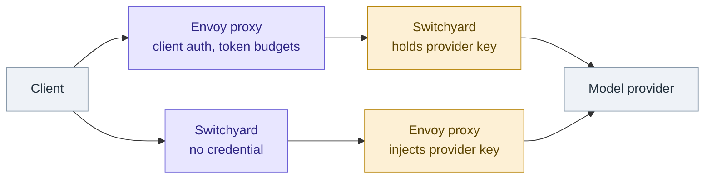
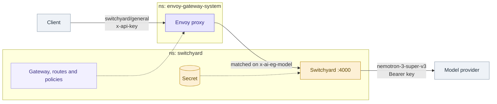
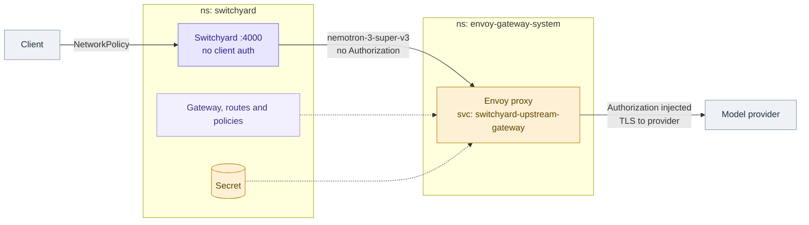
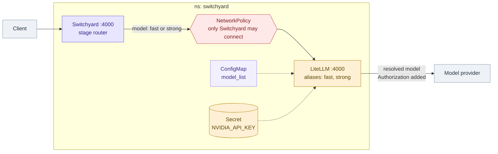

<!--
SPDX-FileCopyrightText: Copyright (c) 2026 NVIDIA CORPORATION & AFFILIATES. All rights reserved.
SPDX-License-Identifier: Apache-2.0
-->

# Switchyard on Kubernetes

Three worked deployments, differing in which component owns ingress and which
owns provider credentials:

| directory | chain |
|---|---|
| [`envoy-ai-gateway-in-front/`](envoy-ai-gateway-in-front) | client → Envoy AI Gateway → Switchyard → provider |
| [`switchyard-in-front-of-envoy-ai-gateway/`](switchyard-in-front-of-envoy-ai-gateway) | client → Switchyard → Envoy AI Gateway → provider |
| [`switchyard-in-front-of-litellm/`](switchyard-in-front-of-litellm) | client → Switchyard → LiteLLM → provider |

All three use the [Switchyard Helm chart](../../deploy/helm/switchyard) for the
Switchyard half and plain manifests for the gateway half.

The first two are covered together below, since they are the same components in
opposite order. The LiteLLM variant is the Kubernetes form of
[`examples/experimental/litellm`](../experimental/litellm), where the gateway
owns model aliases rather than Gateway API routing.

## Which Envoy topology

Both Envoy examples use the same components in opposite order. The choice is
about where the provider credential ends up. (For the LiteLLM variant, see
[its section](#switchyard-in-front-of-litellm) — there the gateway is always
downstream and always holds the credential.)



The top path is Envoy in front, the bottom is Switchyard in front. Amber marks
where the provider credential sits, which is the whole decision.

| | [`envoy-ai-gateway-in-front/`](envoy-ai-gateway-in-front) | [`switchyard-in-front-of-envoy-ai-gateway/`](switchyard-in-front-of-envoy-ai-gateway) |
|---|---|---|
| Chain | client → Envoy AI Gateway → Switchyard → provider | client → Switchyard → Envoy AI Gateway → provider |
| Ingress owner | Envoy Gateway | nothing, by default — see [Client authentication](#client-authentication) |
| Provider credentials | Switchyard pod env | `BackendSecurityPolicy`, injected by Envoy |
| Envoy matches on | Switchyard route ids | provider model ids |
| Token rate limiting applies to | client traffic | Switchyard's upstream traffic |

Pick `envoy-ai-gateway-in-front` when Envoy should be the front door: client
authentication, per-client token budgets, and a single Kubernetes-native
ingress point, with Switchyard as the routing brain behind it.

Pick `switchyard-in-front-of-envoy-ai-gateway` when Switchyard is already the
client's endpoint and you want provider keys and upstream TLS out of the
application pod. No provider credential is mounted into Switchyard at all.

The two are not exclusive. Running both, as the manifests here do, gives Envoy
at the edge and Envoy at the egress with Switchyard in the middle.

### The namespace split

Applying either example creates objects in two namespaces:

| namespace | what lands there |
|---|---|
| `switchyard` | every Gateway API and AI Gateway object below — all *declarations* — plus the Switchyard Deployment and Service |
| `envoy-gateway-system` | the Envoy proxy Deployment and Service that Envoy Gateway *generates*, and which traffic actually flows through |

A `Gateway` declared in `switchyard` is served by a proxy pod running in
`envoy-gateway-system`. That is why
[`04-restrict-access.yaml`](switchyard-in-front-of-envoy-ai-gateway/04-restrict-access.yaml)
puts its NetworkPolicy in `envoy-gateway-system` — one in `switchyard` would
not touch the pod carrying the provider credential — and why `01-gateway.yaml`
pins `EnvoyProxy.provider.kubernetes.envoyService.name`, since the generated
name is otherwise hashed and changes when the Gateway is recreated.

## Client authentication

**Switchyard authenticates no one.** `switchyard-server` serves every request
that reaches its port — there is no API-key check, no JWT validation, no mTLS.
Whatever sits in front of it owns client identity.

That makes the topologies differ in an important way:

- **Envoy AI Gateway in front** — solved by the Gateway.
  [`04-client-auth.yaml`](envoy-ai-gateway-in-front/04-client-auth.yaml) shows a
  `SecurityPolicy` with API-key auth, plus `jwt` and `oidc` alternatives, and
  the `BackendTrafficPolicy` that turns the resulting client identity into a
  per-client token budget.

- **Switchyard in front** — *not* solved. The Gateway is downstream, so it
  authenticates Switchyard to the provider, not the client to Switchyard. Read
  [`04-restrict-access.yaml`](switchyard-in-front-of-envoy-ai-gateway/04-restrict-access.yaml)
  before exposing anything: either keep Switchyard cluster-internal behind a
  NetworkPolicy, or put a Gateway in front of it too, making a sandwich —
  Gateway (client auth) → Switchyard (routing) → Gateway (provider auth).

- **Switchyard in front of LiteLLM** — also *not* solved, and for the same
  reason. LiteLLM holds the provider key but sits downstream, so it does not
  see the client. `01-litellm.yaml` restricts who may reach LiteLLM; nothing
  there restricts who may reach Switchyard. Set a LiteLLM master key if you
  want the gateway to authenticate its callers, and front Switchyard itself if
  it is reachable from outside the cluster.

Note that the provider credential is not the whole risk. Even when the key
lives safely in the gateway, an unauthenticated caller can still spend it.

For machine clients prefer `jwt` over `oidc`: the OIDC flow needs a browser
redirect an SDK client cannot complete.

## Prerequisites

Kubernetes 1.32 or newer, which Envoy AI Gateway v1.0.0 requires.

```bash
helm upgrade -i aieg-crd oci://docker.io/envoyproxy/ai-gateway-crds-helm \
  --version v1.0.0 --namespace envoy-ai-gateway-system --create-namespace

helm upgrade -i eg oci://docker.io/envoyproxy/gateway-helm \
  --version v1.8.3 --namespace envoy-gateway-system --create-namespace \
  -f https://raw.githubusercontent.com/envoyproxy/ai-gateway/v1.0.0/manifests/envoy-gateway-values.yaml

helm upgrade -i aieg oci://docker.io/envoyproxy/ai-gateway-helm \
  --version v1.0.0 --namespace envoy-ai-gateway-system --create-namespace

# Envoy Gateway registers the AI Gateway extension hooks at startup, so it has
# to be restarted once the AI Gateway controller Service exists.
kubectl -n envoy-gateway-system rollout restart deployment/envoy-gateway
```

Build and publish the Switchyard image from the repository root:

```bash
docker build -t ghcr.io/nvidia-nemo/switchyard/switchyard-server:0.2.0 .
docker push ghcr.io/nvidia-nemo/switchyard/switchyard-server:0.2.0
```

## Envoy AI Gateway in front of Switchyard



Dashed arrows are configuration rather than traffic. The objects the manifests
create:

| object | file | why |
|---|---|---|
| `GatewayClass`, `Gateway` `switchyard-ai-gateway` | `01-gateway.yaml` | the listener clients reach |
| `EnvoyProxy` `switchyard-ai-gateway` | `01-gateway.yaml` | sizes the generated proxy |
| `ClientTrafficPolicy` `switchyard-buffer-limit` | `01-gateway.yaml` | 50Mi buffer; the 32KiB default truncates AI payloads |
| `BackendTrafficPolicy` `switchyard-timeouts` | `01-gateway.yaml` | 300s timeout; the default cuts LLM calls off |
| `Backend` `switchyard` | `02-switchyard-backend.yaml` | points at `switchyard.switchyard.svc:4000` |
| `AIServiceBackend` `switchyard` | `02-switchyard-backend.yaml` | declares OpenAI schema; strips `x-forwarded-host` |
| `AIGatewayRoute` `switchyard` | `02-switchyard-backend.yaml` | one matcher per exposed route id; records token costs |
| `EnvoyPatchPolicy` `switchyard-strip-forwarded-host` | `03-forwarded-host.yaml` | removes `x-forwarded-host` during routing, after ext-proc |
| `SecurityPolicy` `switchyard-client-auth` | `04-client-auth.yaml` | requires `x-api-key`; `jwt` and `oidc` shown as alternatives |
| `BackendTrafficPolicy` `switchyard-token-limit` | `04-client-auth.yaml` | per-client token budget, keyed on the authenticated identity |

```bash
kubectl create namespace switchyard

# Provider credential, read by Switchyard.
kubectl -n switchyard create secret generic switchyard-keys \
  --from-literal=NVIDIA_API_KEY="$NVIDIA_API_KEY"

# Client credential, checked by the Gateway. Without this the Gateway accepts
# anonymous traffic and anyone who can reach it can spend the provider key.
kubectl -n switchyard create secret generic switchyard-client-keys \
  --from-literal=team-a="$(openssl rand -hex 32)"

helm upgrade --install switchyard deploy/helm/switchyard \
  --namespace switchyard \
  -f examples/kubernetes/envoy-ai-gateway-in-front/values.switchyard.yaml

kubectl apply -f examples/kubernetes/envoy-ai-gateway-in-front/01-gateway.yaml
kubectl apply -f examples/kubernetes/envoy-ai-gateway-in-front/02-switchyard-backend.yaml
kubectl apply -f examples/kubernetes/envoy-ai-gateway-in-front/03-forwarded-host.yaml
kubectl apply -f examples/kubernetes/envoy-ai-gateway-in-front/04-client-auth.yaml

kubectl -n switchyard wait --for=condition=Programmed gateway/switchyard-ai-gateway --timeout=5m
```

Send a request naming a Switchyard route id as the model, with the client key:

```bash
GW=$(kubectl -n switchyard get gateway switchyard-ai-gateway \
  -o jsonpath='{.status.addresses[0].value}')
API_KEY=$(kubectl -n switchyard get secret switchyard-client-keys \
  -o jsonpath='{.data.team-a}' | base64 -d)

curl -s "http://$GW/v1/chat/completions" \
  -H "x-api-key: $API_KEY" \
  -H 'content-type: application/json' \
  -d '{"model":"switchyard/general","messages":[{"role":"user","content":"hello"}],"max_tokens":600}'
```

Requests without a valid `x-api-key` are rejected with 401 at the Gateway.

Envoy extracts `model` from the body into the `x-ai-eg-model` header, matches
it against the `AIGatewayRoute` rules, and forwards to the `AIServiceBackend`
that points at the Switchyard Service. Switchyard then runs the named algorithm
and calls the provider it selects.

Every route id you want reachable needs a matcher in
[`02-switchyard-backend.yaml`](envoy-ai-gateway-in-front/02-switchyard-backend.yaml).
A model with no matching rule gets a 404 from Envoy, never reaching Switchyard.

Apply [`04-client-auth.yaml`](envoy-ai-gateway-in-front/04-client-auth.yaml) to
require a client credential; requests then need `-H "x-api-key: ..."`.

## Switchyard in front of Envoy AI Gateway



The credential reaches the proxy, never the Switchyard pod. The objects the
manifests create:

| object | file | why |
|---|---|---|
| `GatewayClass`, `Gateway` `switchyard-upstream` | `01-gateway.yaml` | internal egress listener, not client-facing |
| `EnvoyProxy` `switchyard-upstream` | `01-gateway.yaml` | pins the Service name, sets it ClusterIP |
| `ClientTrafficPolicy` `switchyard-upstream-buffer-limit` | `01-gateway.yaml` | 50Mi buffer |
| `BackendTrafficPolicy` `switchyard-upstream-timeouts` | `01-gateway.yaml` | 300s timeout |
| `Backend` `nvidia` | `02-provider-backend.yaml` | provider hostname, port 443 |
| `BackendTLSPolicy` `nvidia-tls` | `02-provider-backend.yaml` | validates upstream TLS against system roots |
| `AIServiceBackend` `nvidia` | `02-provider-backend.yaml` | OpenAI schema, `/v1` prefix |
| `BackendSecurityPolicy` `nvidia-apikey` | `02-provider-backend.yaml` | injects `Authorization`, keeping the key out of the pod |
| `AIGatewayRoute` `nvidia` | `02-provider-backend.yaml` | one matcher per provider model id |
| `EnvoyPatchPolicy` `switchyard-upstream-strip-forwarded-host` | `03-forwarded-host.yaml` | `append_x_forwarded_host: false`; removal alone is too late on egress |
| `NetworkPolicy` `switchyard-egress-ingress-restriction` | `04-restrict-access.yaml` | limits who may call Switchyard |
| `NetworkPolicy` `switchyard-upstream-gateway-restriction` | `04-restrict-access.yaml` | limits who may reach the credential-bearing proxy |

```bash
kubectl create namespace switchyard

# BackendSecurityPolicy requires the Secret key to be literally `apiKey`.
kubectl -n switchyard create secret generic nvidia-apikey \
  --from-literal=apiKey="$NVIDIA_API_KEY"

helm upgrade --install switchyard-egress deploy/helm/switchyard \
  --namespace switchyard \
  -f examples/kubernetes/switchyard-in-front-of-envoy-ai-gateway/values.switchyard.yaml

kubectl apply -f examples/kubernetes/switchyard-in-front-of-envoy-ai-gateway/01-gateway.yaml
kubectl apply -f examples/kubernetes/switchyard-in-front-of-envoy-ai-gateway/02-provider-backend.yaml
kubectl apply -f examples/kubernetes/switchyard-in-front-of-envoy-ai-gateway/03-forwarded-host.yaml

kubectl -n switchyard wait --for=condition=Programmed gateway/switchyard-upstream --timeout=5m
```

```bash
kubectl -n switchyard port-forward svc/switchyard-egress 4000:4000 &

curl -s localhost:4000/v1/chat/completions \
  -H 'content-type: application/json' \
  -d '{"model":"switchyard/general","messages":[{"role":"user","content":"hello"}],"max_tokens":600}'
```

Here the deployment TOML's `base_url` points at the Gateway's ClusterIP
Service, and no `api_key_env` is set, so Switchyard sends no `Authorization`
header. Envoy adds one from the `BackendSecurityPolicy` on the way out.

The Service name is pinned through
`EnvoyProxy.spec.provider.kubernetes.envoyService.name`, because Envoy Gateway
otherwise generates a hashed name that would change if the Gateway were
recreated — and `base_url` has to be stable.

Envoy matches on **provider** model ids here, so the values in
[`02-provider-backend.yaml`](switchyard-in-front-of-envoy-ai-gateway/02-provider-backend.yaml)
must match the `id` field of each `[targets.*]` table, not the route ids.

## Switchyard in front of LiteLLM

The Kubernetes form of [`examples/experimental/litellm`](../experimental/litellm).
LiteLLM owns provider access, credentials and model aliases; Switchyard owns the
routing policy and addresses aliases rather than provider model ids.



**Aliases are the contract between the two.** Switchyard's `[targets.*].id`
values match `model_name` in the LiteLLM `model_list`, so repointing an alias at
a different provider or model is a change to the ConfigMap alone — the
Switchyard deployment TOML never mentions a provider model id.

| object | file | why |
|---|---|---|
| `ConfigMap` `litellm-config` | `01-litellm.yaml` | the `model_list`; aliases `fast` and `strong` |
| `Deployment` `litellm` | `01-litellm.yaml` | the gateway; probes `/health/liveliness` and `/health/readiness` |
| `Service` `litellm` | `01-litellm.yaml` | ClusterIP on 4000, what Switchyard's `base_url` points at |
| `NetworkPolicy` `litellm-ingress-restriction` | `01-litellm.yaml` | limits who may reach the credential-bearing gateway |
| `Secret` `litellm-provider-keys` | created below | resolved by `os.environ/NVIDIA_API_KEY` in the ConfigMap |

```bash
kubectl create namespace switchyard

# LiteLLM holds the provider credential; Switchyard gets none.
kubectl -n switchyard create secret generic litellm-provider-keys \
  --from-literal=NVIDIA_API_KEY="$NVIDIA_API_KEY"

kubectl apply -f examples/kubernetes/switchyard-in-front-of-litellm/01-litellm.yaml
kubectl -n switchyard rollout status deploy/litellm --timeout=15m

helm upgrade --install switchyard deploy/helm/switchyard \
  --namespace switchyard \
  -f examples/kubernetes/switchyard-in-front-of-litellm/values.switchyard.yaml
```

```bash
kubectl -n switchyard port-forward svc/switchyard 4000:4000 &

curl -s localhost:4000/v1/chat/completions \
  -H 'content-type: application/json' \
  -d '{"model":"switchyard/stage","messages":[{"role":"user","content":"hello"}],"max_tokens":600}'
```

Two things that cost time on a first run:

- **The image is 350MB and took 7m33s to pull** on a cold node, so the first
  `rollout status` can look like a hang. The 15m timeout above is deliberate.
- **LiteLLM needs real memory.** At a 1Gi limit it was `OOMKilled` nine seconds
  into startup, crash-looping with no log output at all — the manifest looks
  fine and the pod simply dies. The example sets 3Gi.

`switchyard/stage` uses the same stage router as the Compose example: an initial
or ambiguous turn falls open to `fast`, and error-recovery signals move a turn to
`strong`. Those signals come from recent tool results, so on single-turn traffic
every turn takes the picker default — see the note on `stage_router` below.
`switchyard/fast` and `switchyard/strong` are passthrough routes to each alias,
useful as smoke tests and as cost baselines.

## Notes

**`x-forwarded-host` breaks some providers.** Envoy preserves the client's
original Host in `x-forwarded-host` when it rewrites Host for the backend, and
Switchyard forwards inbound request headers to the provider it selects — so the
header travels all the way upstream. A provider that routes on it resolves the
wrong virtual host and rejects the call; the NVIDIA inference endpoint answers
with a model-group 404 even when the header holds its own hostname. Both
examples ship an `EnvoyPatchPolicy` (`03-forwarded-host.yaml`) that removes it.
`AIServiceBackend.headerMutation` is not sufficient on its own, because the AI
Gateway's ext-proc mutation runs before Envoy sets the header.

**Buffer limits.** Envoy Gateway defaults client connection buffers to 32KiB,
which truncates realistic chat payloads. Both examples set a
`ClientTrafficPolicy` with `bufferLimit: 50Mi`.

**Timeouts.** Both examples set a `BackendTrafficPolicy` request timeout of
300s. LLM calls are slow, and an `llm_classifier` route adds a classifier call
in front of the served call, so the Envoy default would cut requests off.

**Reasoning models.** Models that emit `reasoning_content` spend the token
budget on reasoning before producing `content`. Too small a `max_tokens` yields
`finish_reason: "length"` with `content: null` — allow a few hundred tokens.

**Path prefixes.** `AIServiceBackend.spec.schema.prefix` sets the upstream
path. The examples use `/v1`; OpenRouter needs `/api/v1`.

**Startup validation.** `switchyard-server` refuses to start when an
`api_key_env` named in the TOML is missing from the environment. A missing or
misnamed Secret key therefore surfaces as a crash-looping pod, not as
unauthenticated upstream calls. Validate a deployment before rolling it out
with `switchyard-server --config routes.toml --dry-run`.

**Metrics.** Switchyard exports its own Prometheus metrics on the same port at
`/metrics`, covering routing overhead, per-model tokens, and classifier
fail-open counts. Those complement, rather than duplicate, Envoy's token
metrics; see the
[metrics table](../../crates/switchyard-server/README.md#metrics).
