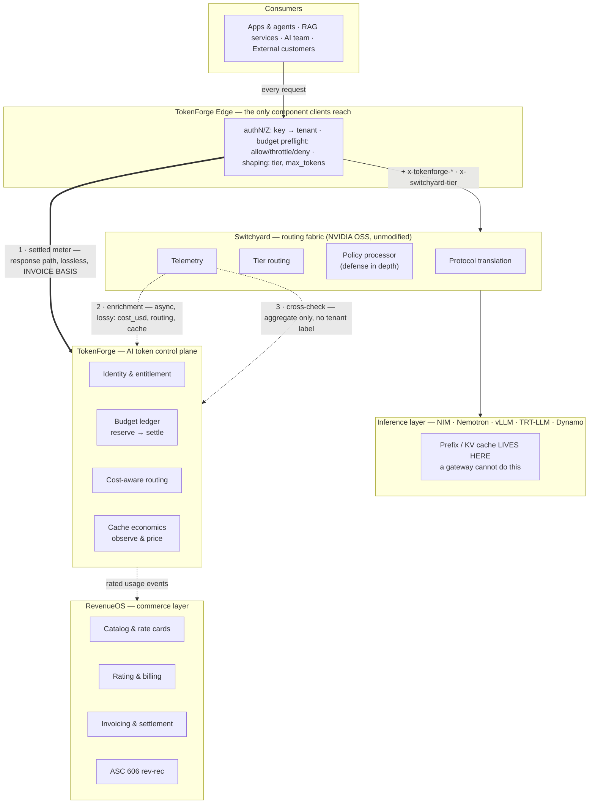

# Reference architecture v0.2 — what changed and why

*(If the SVG above renders without colour, open
[`architecture.svg`](architecture.svg) directly — GitHub strips the embedded
`<style>` block from inline SVG. A Mermaid fallback is at the bottom of this
page.)*

## Why the diagram was redrawn

The original diagram had two structural errors. Both were caught in review, and
both were errors of *architecture*, not of drawing.

### Correction 1 — caching was in the wrong layer

The old diagram had a **"Cache & shaping — prefix, semantic"** box inside the
control plane. That collapsed two different products at two different layers into
one box, and put both in a layer that cannot implement either of them.

| | Old | New |
| --- | --- | --- |
| Prefix / KV cache | control-plane box | **inference layer**, flagged as sourced |
| Semantic cache | same box, implied shipping | absent from the diagram; Phase C, opt-in |
| Control plane | "Cache & shaping" | **"Cache economics — observe & price"** |

A gateway holds no GPU memory and no attention state, so prefix/KV caching cannot
live there — it belongs to vLLM APC, TensorRT-LLM, SGLang, and Dynamo's KV-aware
routing. The diagram now says so explicitly, with a second card reading *"A
gateway cannot do this."* That sentence is there for the solution-architect
review, where the old diagram would have failed.

What the control plane *does* own is the economics: metering cached reads and
cache writes, pricing them at their own rates, and showing the resulting margin
uplift. Renaming the box to **"observe & price"** turns an overclaim into a
defensible differentiator. Reasoning in
[`04-caching-decision.md`](04-caching-decision.md).

### Correction 2 — metering was invisible, and wrong

The old diagram showed one arrow into the commerce layer, implying a single
metering path. In the spec that path was the async intake sink, which is bounded
and drops on a full queue — so the picture implied an invoice built on a lossy
telemetry queue.

The new diagram gives metering its own rail with **three numbered meters**, ranked
by what each is actually good for:

1. **Settled meter** — the Edge reads `usage` from the response body,
   synchronously, in-path. Lossless by construction. **→ invoice basis.**
2. **Enrichment** — the intake sink. Async, may drop. Carries `cost_usd`, the
   routing decision, and the cache breakdown, none of which the response body
   has. **→ not a system of record.**
3. **Cross-check** — `/v1/stats` and `/metrics`. Aggregate only: no tenant label,
   no cost metric, unauthenticated.

A fourth card answers the obvious question — *why three?* Because one meter cannot
distinguish "we lost records" from "these two numbers legitimately differ." Both
real divergences are named on the diagram: classifier spend the Edge cannot see,
and unauthenticated bypass attempts. Reasoning in
[`03-metering-integrity.md`](03-metering-integrity.md).

## Two other changes worth noting

**TokenForge Edge is now on the diagram, at the top.** It was missing before,
which made the whole picture wrong: Switchyard has no authentication, so
*something* has to sit in front of it, and that something is where auth, budget
preflight, and tier shaping happen. Showing it also makes the security boundary
legible — the band reads "The only component clients reach."

**Two flow directions, drawn differently.** Solid grey arrows are the request
path, downward. The dashed violet arrow is the money path, upward — rated usage
events flowing into RevenueOS. The old single-axis stack conflated a value
hierarchy with a call graph, which is why the metering story was unreadable.

## Mermaid fallback

The Mermaid version loses the meter ranking's visual weight, so treat the SVG as
canonical for anything customer-facing.
